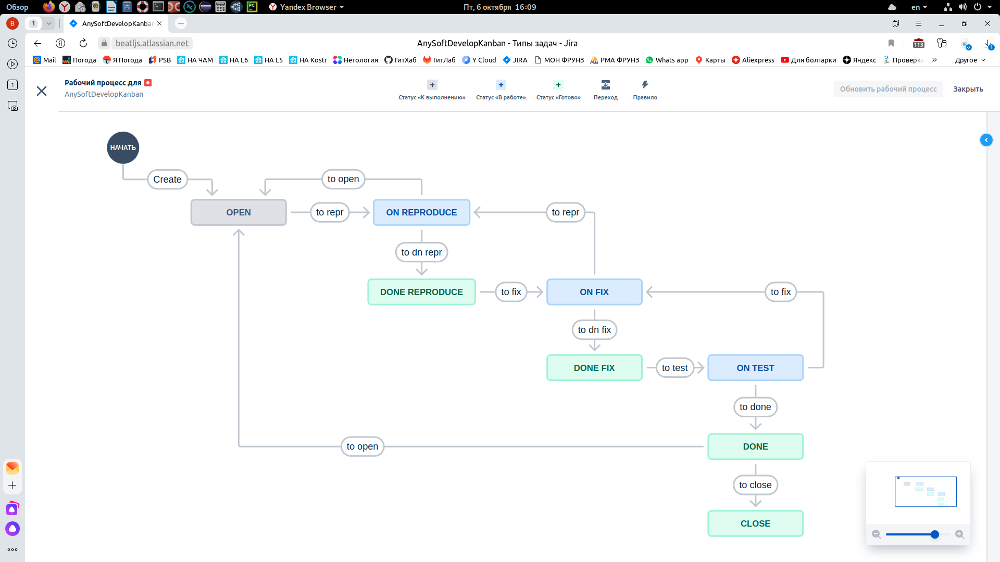
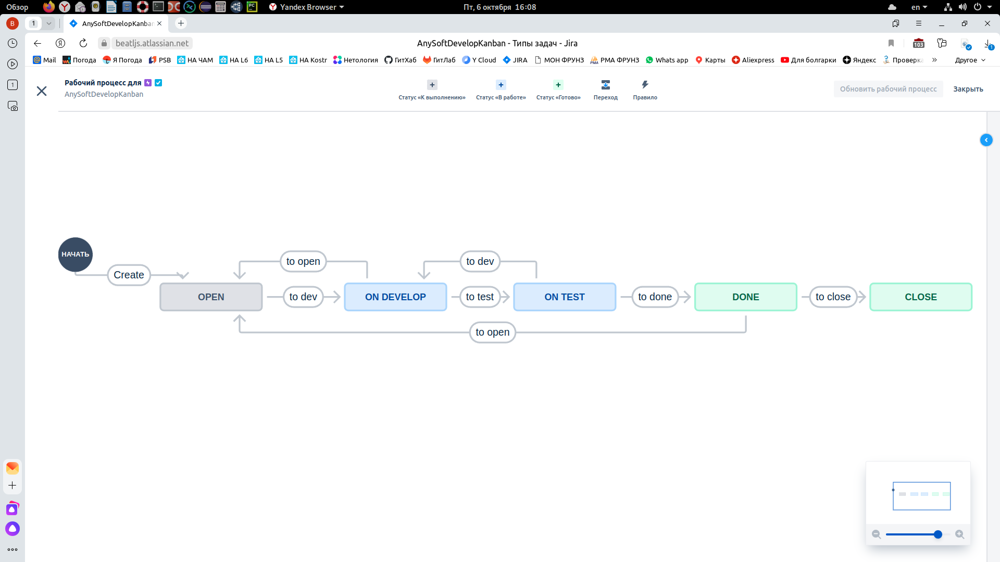

---

### Учебная группа DevOps-32

---

## Решение по домашнему заданию к занятию 7 «Жизненный цикл ПО»

- [Описание](#description)
- [Скриншоты](#screens)
- [Ссылки на workflow](#links)
- [Исполнитель](#student)

---

###### Description
### Описание

Здесь приводится результат выполнения домашнего задания 7 «Жизненный цикл ПО» c использованием `Jira`.

В соответствии с заданием созданы два проекта для `Kanban` и `Scrum`.

Настроены workflow для задач типа bug и для остальных задач.

В Kanban созданы Epic с подзадачами и задача Bug. Все задачи проведены по статусам workflow от open до done.

В Scrum создан спринт. Задачи также проведены по статусам. Спринт завершен. 

---

###### screens
### Скриншоты

Workflow для задач bug

Workflow для остальных задач

---

###### links
### Ссылки на .xml workflow

[Workflow для задач bug](https://github.com/beatljs/mnt-homeworks/blob/09-ci-01-intro/Jira/MyWorkflowForBug.xml)

[Workflow для остальных задач](https://github.com/beatljs/mnt-homeworks/blob/09-ci-01-intro/Jira/MyDefaultWorkflow.xml)

---

###### Student
### Исполнитель

Сергей Жуков DevOps-32

---

