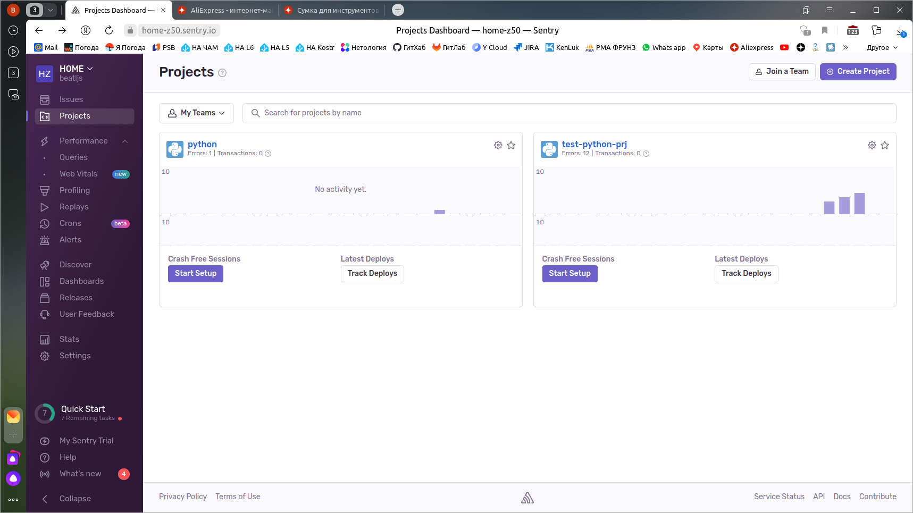
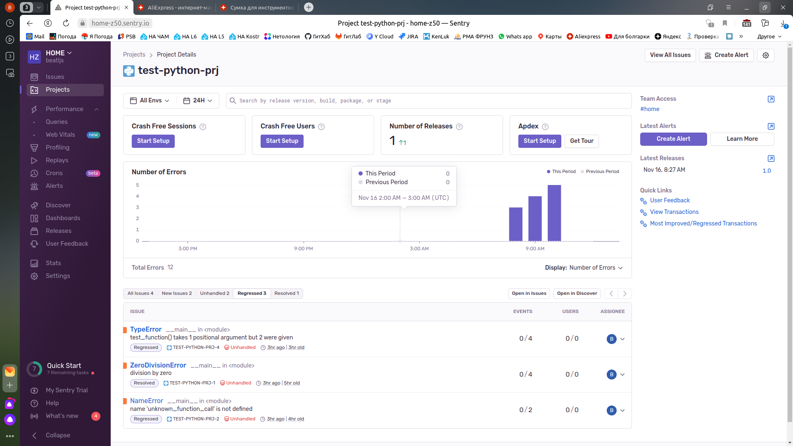
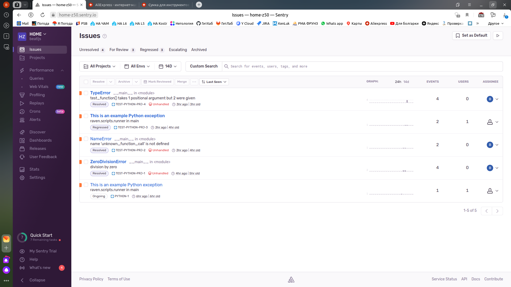
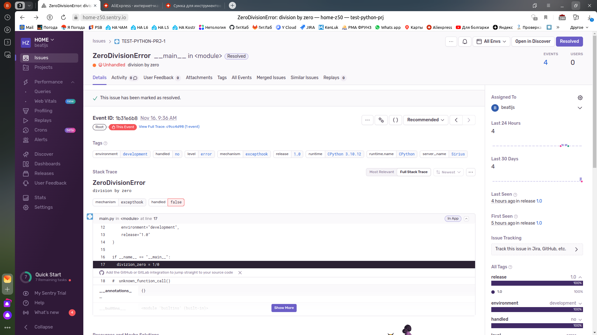
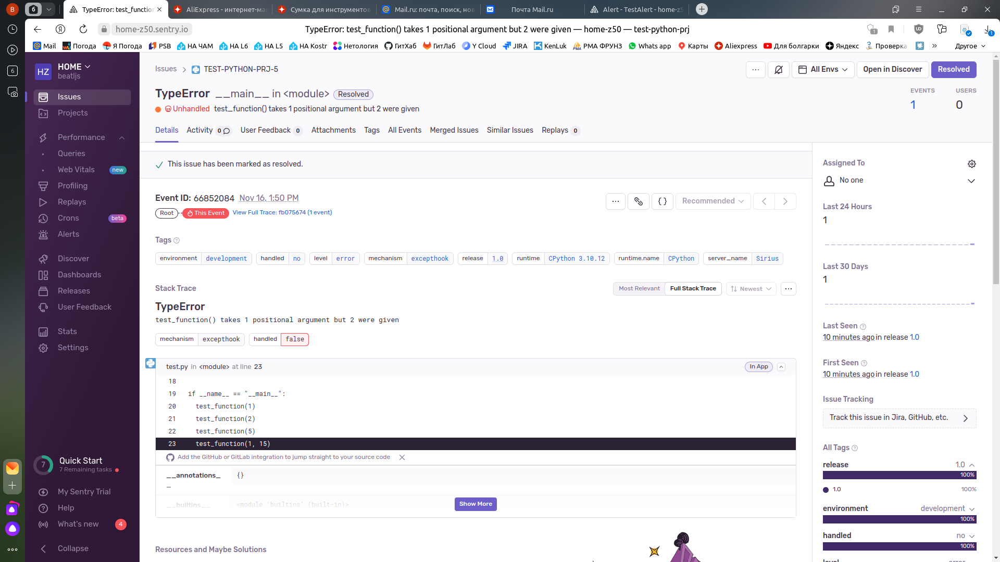
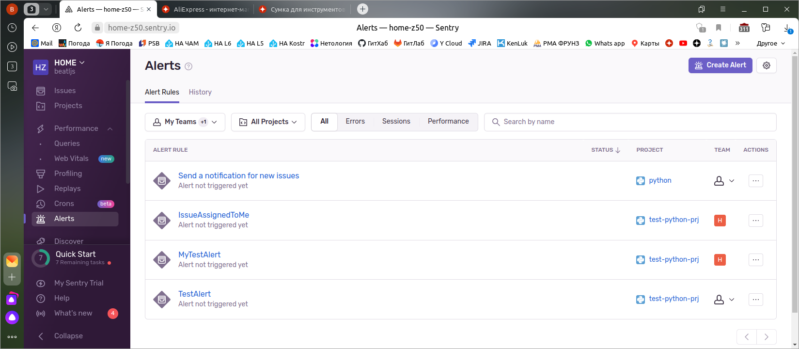
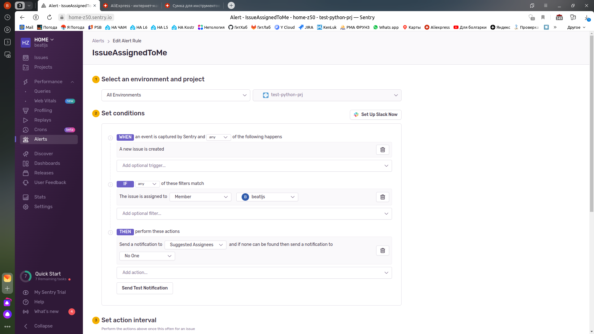

---


### Учебная группа DevOps-32

---

## Решение по домашнему заданию 10-monitoring-05-sentry к занятию 16 «Платформа мониторинга Sentry»


- [Подготовка](#prepare)
- [Работа с тестовыми скриптами Python](#test)
- [Работа с Alerts](#alerts)
- [Исполнитель](#student)

---

###### prepare
### Подготовка

 В соответствии с домашним заданием была выполнена регистрация на `sentry.io` и создан тестовый проект `test-python-prj`

<details>
    <summary> Cкриншот вкладки `Projects`...  </summary>



</details>

---

###### test
### Работа с тестовыми скриптами Python

Для изучения работы с системой был установлен `sentry-sdk`:  

<details>
    <summary> Вывод консоли при установке `sentry-sdk`...  </summary>

```
beatl@Sirius:~/mnt-homeworks$ pip install --upgrade sentry-sdk
Defaulting to user installation because normal site-packages is not writeable
Collecting sentry-sdk
  Downloading sentry_sdk-1.35.0-py2.py3-none-any.whl (248 kB)
     ━━━━━━━━━━━━━━━━━━━━━━━━━━━━━━━━━━━━━━━━ 248.6/248.6 KB 1.9 MB/s eta 0:00:00
Requirement already satisfied: certifi in /usr/lib/python3/dist-packages (from sentry-sdk) (2020.6.20)
Collecting urllib3>=1.26.11
  Downloading urllib3-2.1.0-py3-none-any.whl (104 kB)
     ━━━━━━━━━━━━━━━━━━━━━━━━━━━━━━━━━━━━━━━━ 104.6/104.6 KB 7.3 MB/s eta 0:00:00
Installing collected packages: urllib3, sentry-sdk
Successfully installed sentry-sdk-1.35.0 urllib3-2.1.0
```

</details>

и подготовлены тестовые файлы на `python`:

[Файл main.py](./main.py)

[Файл test.py](./test.py)

При запуске файлов на выполнение успешно генерировались события в `centry`

<details>
    <summary> Вывод консоли при запуске файлов на выполнение...  </summary>

```
beatl@Sirius:~/mnt-homeworks$ python3 main.py
Traceback (most recent call last):
  File "/home/beatl/mnt-homeworks/main.py", line 17, in <module>
    divizion_zero = 1/0
ZeroDivisionError: division by zero
Sentry is attempting to send 2 pending events
Waiting up to 2 seconds
Press Ctrl-C to quit

beatl@Sirius:~/mnt-homeworks$ python3 main.py
Traceback (most recent call last):
  File "/home/beatl/mnt-homeworks/main.py", line 18, in <module>
    unknown_function_call()
NameError: name 'unknown_function_call' is not defined
Sentry is attempting to send 2 pending events
Waiting up to 2 seconds
Press Ctrl-C to quit

beatl@Sirius:~/mnt-homeworks$ python3 test.py
One is selected.
Two is selected.
Another is selected.
Traceback (most recent call last):
  File "/home/beatl/mnt-homeworks/test.py", line 28, in <module>
    test_function(1, 15)
TypeError: test_function() takes 1 positional argument but 2 were given
Sentry is attempting to send 2 pending events
Waiting up to 2 seconds
Press Ctrl-C to quit
```

</details>

<details>
    <summary> Cкриншот страницы проекта с issue ...  </summary>



</details>

<details>
    <summary> Cкриншот вкладки `Issues` ...  </summary>



</details>

<details>
    <summary> Cкриншот stack-trace для `divizion_zero` из main.py ...  </summary>



</details>

<details>
    <summary> Cкриншот stack-trace для `TypeError` из test.py ...  </summary>



</details>

---

###### alerts
### Работа c Alerts

Для изучения работы было создано несколько Alert-ов.

<details>
    <summary> Cкриншот вкладки `Alerts` ...  </summary>



</details>

<details>
    <summary> Пример настройки `Alert` ...  </summary>



</details>

[Пришедший на почту Alert](./screenshots/alert.pdf)

---

###### Student
### Исполнитель

Сергей Жуков DevOps-32

---
