---


### Учебная группа DevOps-32

---

## Решение по домашнему заданию 09-ci-04-jenkins к занятию 10 "Jenkins" 


- [Описание](#description)
- [Cкриншоты к 1 пункту ДЗ](#part1)
- [Cкриншоты ко 2 пункту ДЗ](#part2)
- [Файлы к 3 пункту ДЗ ](#part3)
- [Cкриншоты к 4 пункту ДЗ](#part4)
- [Файлы и скриншоты к 5-7 пунктам ДЗ](#part5)
- [Исполнитель](#student)

---

###### Description
### Описание

В соответствии с заданием выполнена подготовка инфрастуктуры. Для этого написан сценарий `Terraform` создающий в `YandexCloud` две ВМ.

Ссылка на репозиторий со сценарием `terraform`: [Сценраий terraform](https://github.com/beatljs/mnt-homeworks/tree/09-ci-04-jenkins)

<details>
    <summary> Скриншот созданных ВМ..  </summary>

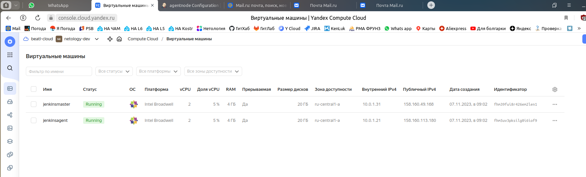

</details>

В сценарий включен `Ansible playbook` из каталога [infrastructure](https://github.com/netology-code/mnt-homeworks/tree/MNT-video/09-ci-04-jenkins/infrastructure) ДЗ.
Далее произведена настройка `Jenkins` на `jenkinsmaster`. 

<details>
    <summary> Скриншот настройки агента...  </summary>

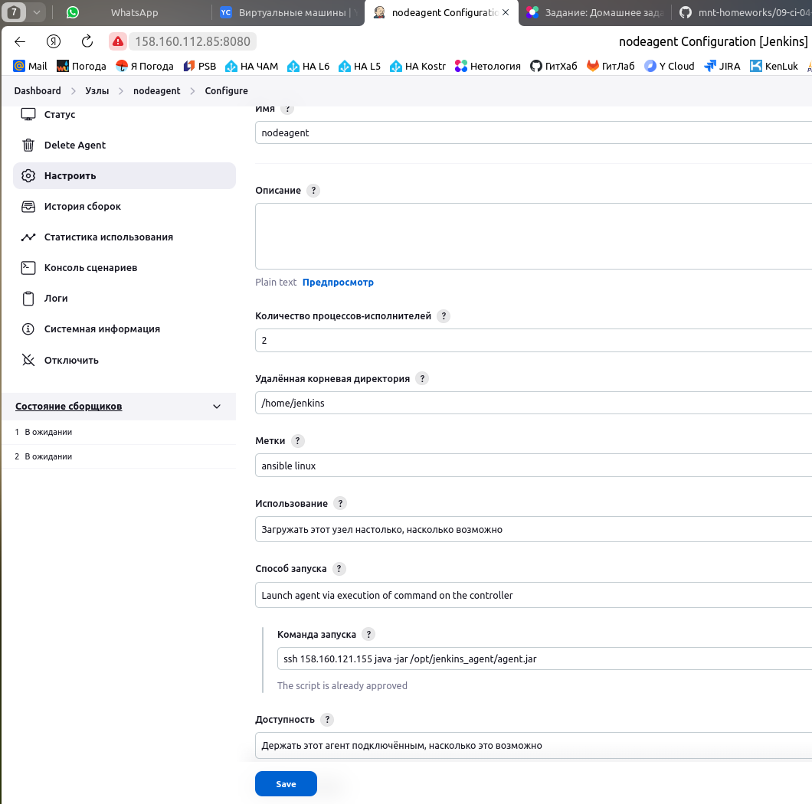

</details>

<details>
    <summary> Log успешного подключения агента ...  </summary>


```
[11/10/23 10:36:31] Launching agent
$ ssh 158.160.121.155 java -jar /opt/jenkins_agent/agent.jar
<===[JENKINS REMOTING CAPACITY]===>channel started
Remoting version: 3131.vf2b_b_798b_ce99
Launcher: CommandLauncher
Communication Protocol: Standard in/out
This is a Unix agent
WARNING: An illegal reflective access operation has occurred
WARNING: Illegal reflective access by jenkins.slaves.StandardOutputSwapper$ChannelSwapper to constructor java.io.FileDescriptor(int)
WARNING: Please consider reporting this to the maintainers of jenkins.slaves.StandardOutputSwapper$ChannelSwapper
WARNING: Use --illegal-access=warn to enable warnings of further illegal reflective access operations
WARNING: All illegal access operations will be denied in a future release
Evacuated stdout
Agent successfully connected and online
```
</details>

Как выяснилось в последствии для успешного выполнения ДЗ на jenkinsagent нужно установить `molecule` и драйвер `molecule_docker`.
В идеале их установку надо бы добавить в `playbook Ansible`, но т.к. цель ДЗ - изучение `Jenkins`, эта возможность подразумевается,
а `molecule` и драйвер установлены на `jenkinsagent` вручную, подключившись к `jenkinsagent` по `ssh`.      

Репозиторий с `role` для  Job-ов запускающих `molecule test`: [репозиторий c vector-role](https://github.com/beatljs/vector-role.git)

---

###### part1
### Cкриншоты к 1 пункту ДЗ

<details>
    <summary> Скриншот настройки `Frestyle Job` (часть 1)...  </summary>

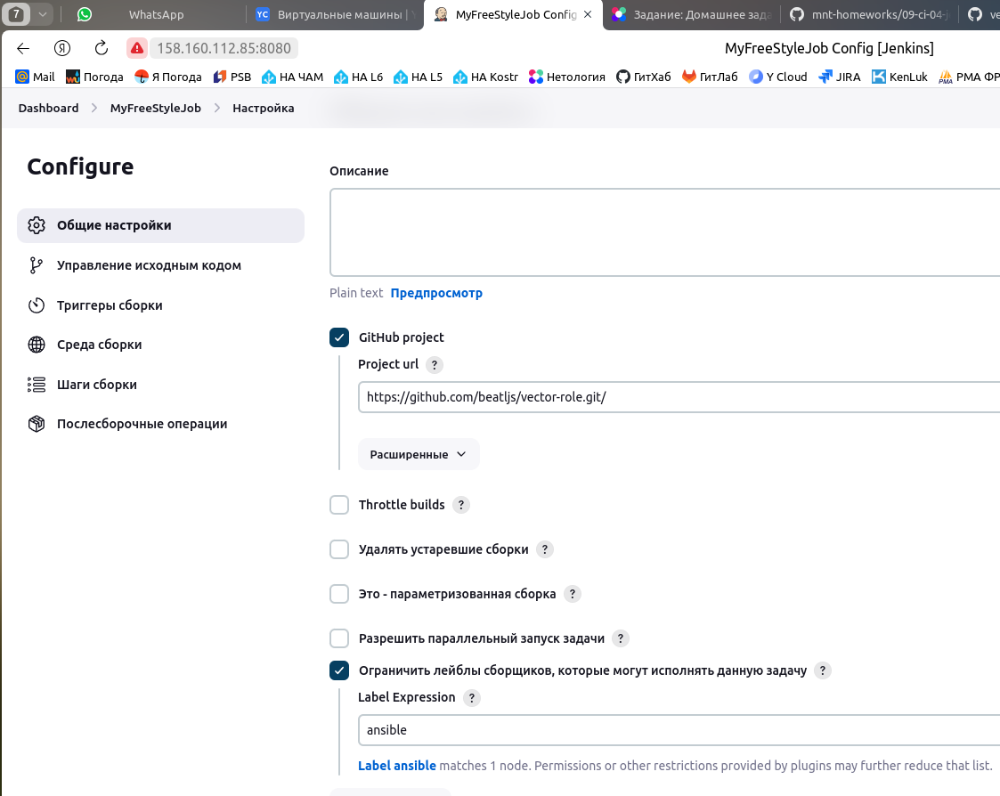

</details>
<details>
    <summary> Скриншот настройки `Frestyle Job` (часть 2)...  </summary>

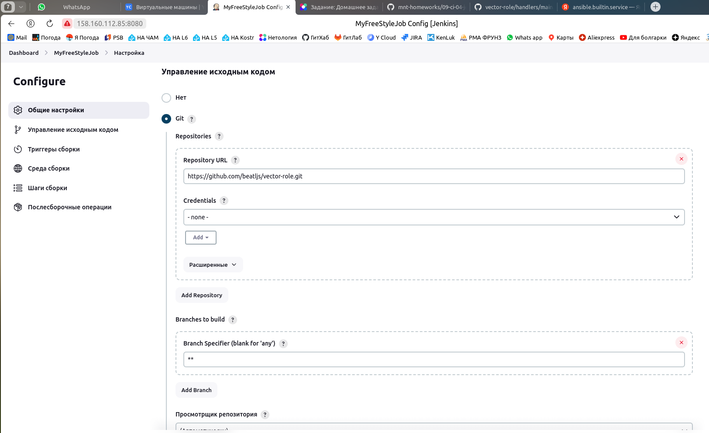

</details>
<details>
    <summary> Скриншот настройки `Frestyle Job` (часть 3)...  </summary>

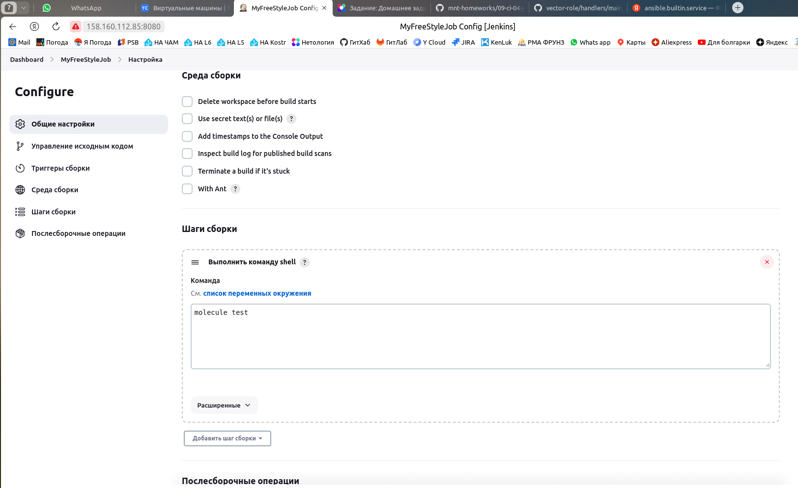

</details>

<details>
    <summary> Скриншот проекта `Frestyle Job` ...  </summary>

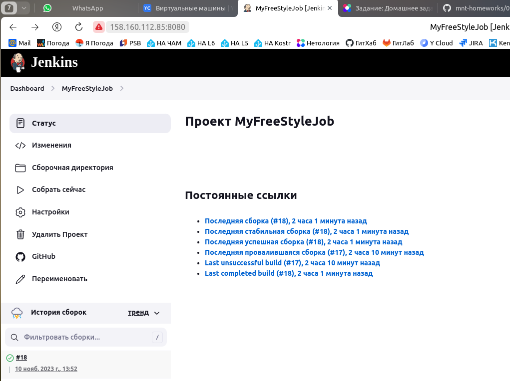
</details>

<details>
    <summary> Log успешной сборки `Frestyle Job` ...  </summary>

```
Started by user Сергей Иванович Жуков
Running as SYSTEM
Building remotely on nodeagent (linux ansible) in workspace /home/jenkins/workspace/MyFreeStyleJob
The recommended git tool is: NONE
No credentials specified
 > git rev-parse --resolve-git-dir /home/jenkins/workspace/MyFreeStyleJob/.git # timeout=10
Fetching changes from the remote Git repository
 > git config remote.origin.url https://github.com/beatljs/vector-role.git # timeout=10
Fetching upstream changes from https://github.com/beatljs/vector-role.git
 > git --version # timeout=10
 > git --version # 'git version 1.8.3.1'
 > git fetch --tags --progress https://github.com/beatljs/vector-role.git +refs/heads/*:refs/remotes/origin/* # timeout=10
Seen branch in repository origin/main
Seen 1 remote branch
 > git show-ref --tags -d # timeout=10
Checking out Revision a14386c025532dc6053d6306ebe25f1a099dbfc8 (origin/main)
 > git config core.sparsecheckout # timeout=10
 > git checkout -f a14386c025532dc6053d6306ebe25f1a099dbfc8 # timeout=10
Commit message: "Update main.yml"
 > git rev-list --no-walk a550acf9a905c4df24728834988810468319e680 # timeout=10
[MyFreeStyleJob] $ /bin/sh -xe /tmp/jenkins6678691589757436942.sh
+ molecule test
/usr/local/lib/python3.6/site-packages/ansible/parsing/vault/__init__.py:44: CryptographyDeprecationWarning: Python 3.6 is no longer supported by the Python core team. Therefore, support for it is deprecated in cryptography. The next release of cryptography will remove support for Python 3.6.
  from cryptography.exceptions import InvalidSignature
/home/jenkins/.local/lib/python3.6/site-packages/requests/__init__.py:104: RequestsDependencyWarning: urllib3 (1.26.18) or chardet (5.0.0)/charset_normalizer (2.0.12) doesn't match a supported version!
  RequestsDependencyWarning)
INFO     default scenario test matrix: dependency, lint, cleanup, destroy, syntax, create, prepare, converge, idempotence, side_effect, verify, cleanup, destroy
INFO     Performing prerun...
INFO     Set ANSIBLE_LIBRARY=/home/jenkins/.cache/ansible-compat/15b80c/modules:/home/jenkins/.ansible/plugins/modules:/usr/share/ansible/plugins/modules
INFO     Set ANSIBLE_COLLECTIONS_PATH=/home/jenkins/.cache/ansible-compat/15b80c/collections:/home/jenkins/.ansible/collections:/usr/share/ansible/collections
INFO     Set ANSIBLE_ROLES_PATH=/home/jenkins/.cache/ansible-compat/15b80c/roles:/home/jenkins/.ansible/roles:/usr/share/ansible/roles:/etc/ansible/roles
INFO     Using /home/jenkins/.ansible/roles/sergey.vector_role symlink to current repository in order to enable Ansible to find the role using its expected full name.
INFO     Running default > dependency
WARNING  Skipping, missing the requirements file.
WARNING  Skipping, missing the requirements file.
INFO     Running default > lint
/usr/local/lib/python3.6/site-packages/ansible/parsing/vault/__init__.py:44: CryptographyDeprecationWarning: Python 3.6 is no longer supported by the Python core team. Therefore, support for it is deprecated in cryptography. The next release of cryptography will remove support for Python 3.6.
  from cryptography.exceptions import InvalidSignature
WARNING: PATH altered to include /usr/bin
WARNING  /usr/local/lib/python3.6/site-packages/ansible/parsing/vault/__init__.py:44: CryptographyDeprecationWarning: Python 3.6 is no longer supported by the Python core team. Therefore, support for it is deprecated in cryptography. The next release of cryptography will remove support for Python 3.6.
  from cryptography.exceptions import InvalidSignature

WARNING  Loading custom .yamllint config file, this extends our internal yamllint config.
INFO     Running default > cleanup
WARNING  Skipping, cleanup playbook not configured.
INFO     Running default > destroy
INFO     Sanity checks: 'docker'

PLAY [Destroy] *****************************************************************

TASK [Destroy molecule instance(s)] ********************************************
/usr/local/lib/python3.6/site-packages/ansible/parsing/vault/__init__.py:44: CryptographyDeprecationWarning: Python 3.6 is no longer supported by the Python core team. Therefore, support for it is deprecated in cryptography. The next release of cryptography will remove support for Python 3.6.
  from cryptography.exceptions import InvalidSignature
changed: [localhost] => (item=pyubuntu)

TASK [Wait for instance(s) deletion to complete] *******************************
FAILED - RETRYING: Wait for instance(s) deletion to complete (300 retries left).
ok: [localhost] => (item=pyubuntu)

TASK [Delete docker networks(s)] ***********************************************

PLAY RECAP *********************************************************************
localhost                  : ok=2    changed=1    unreachable=0    failed=0    skipped=1    rescued=0    ignored=0

INFO     Running default > syntax

playbook: /home/jenkins/workspace/MyFreeStyleJob/molecule/default/converge.yml
/usr/local/lib/python3.6/site-packages/ansible/parsing/vault/__init__.py:44: CryptographyDeprecationWarning: Python 3.6 is no longer supported by the Python core team. Therefore, support for it is deprecated in cryptography. The next release of cryptography will remove support for Python 3.6.
  from cryptography.exceptions import InvalidSignature
INFO     Running default > create

PLAY [Create] ******************************************************************

TASK [Log into a Docker registry] **********************************************
/usr/local/lib/python3.6/site-packages/ansible/parsing/vault/__init__.py:44: CryptographyDeprecationWarning: Python 3.6 is no longer supported by the Python core team. Therefore, support for it is deprecated in cryptography. The next release of cryptography will remove support for Python 3.6.
  from cryptography.exceptions import InvalidSignature
skipping: [localhost] => (item=None)
skipping: [localhost]

TASK [Check presence of custom Dockerfiles] ************************************
ok: [localhost] => (item={'command': 'systemd', 'image': 'beatljs/pyubuntu:systemd', 'name': 'pyubuntu', 'privileged': True})

TASK [Create Dockerfiles from image names] *************************************
changed: [localhost] => (item={'command': 'systemd', 'image': 'beatljs/pyubuntu:systemd', 'name': 'pyubuntu', 'privileged': True})

TASK [Discover local Docker images] ********************************************
ok: [localhost] => (item={'diff': [], 'dest': '/home/jenkins/.cache/molecule/MyFreeStyleJob/default/Dockerfile_beatljs_pyubuntu_systemd', 'src': '/home/jenkins/.ansible/tmp/ansible-tmp-1699624373.8558652-6113-185550216402377/source', 'md5sum': '3fdf51a4e575e714a1183c70787a1dba', 'checksum': '69932a0fdd4289ad38a5d68027b8816193c0235b', 'changed': True, 'uid': 1000, 'gid': 1001, 'owner': 'jenkins', 'group': 'jenkins', 'mode': '0600', 'state': 'file', 'size': 1053, 'invocation': {'module_args': {'src': '/home/jenkins/.ansible/tmp/ansible-tmp-1699624373.8558652-6113-185550216402377/source', 'dest': '/home/jenkins/.cache/molecule/MyFreeStyleJob/default/Dockerfile_beatljs_pyubuntu_systemd', 'mode': '0600', 'follow': False, '_original_basename': 'Dockerfile.j2', 'checksum': '69932a0fdd4289ad38a5d68027b8816193c0235b', 'backup': False, 'force': True, 'unsafe_writes': False, 'content': None, 'validate': None, 'directory_mode': None, 'remote_src': None, 'local_follow': None, 'owner': None, 'group': None, 'seuser': None, 'serole': None, 'selevel': None, 'setype': None, 'attributes': None}}, 'failed': False, 'item': {'command': 'systemd', 'image': 'beatljs/pyubuntu:systemd', 'name': 'pyubuntu', 'privileged': True}, 'ansible_loop_var': 'item', 'i': 0, 'ansible_index_var': 'i'})

TASK [Build an Ansible compatible image (new)] *********************************
ok: [localhost] => (item=molecule_local/beatljs/pyubuntu:systemd)

TASK [Create docker network(s)] ************************************************

TASK [Determine the CMD directives] ********************************************
ok: [localhost] => (item={'command': 'systemd', 'image': 'beatljs/pyubuntu:systemd', 'name': 'pyubuntu', 'privileged': True})

TASK [Create molecule instance(s)] *********************************************
changed: [localhost] => (item=pyubuntu)

TASK [Wait for instance(s) creation to complete] *******************************
FAILED - RETRYING: Wait for instance(s) creation to complete (300 retries left).
changed: [localhost] => (item={'started': 1, 'finished': 0, 'ansible_job_id': '213041342771.6248', 'results_file': '/home/jenkins/.ansible_async/213041342771.6248', 'changed': True, 'failed': False, 'item': {'command': 'systemd', 'image': 'beatljs/pyubuntu:systemd', 'name': 'pyubuntu', 'privileged': True}, 'ansible_loop_var': 'item'})

PLAY RECAP *********************************************************************
localhost                  : ok=7    changed=3    unreachable=0    failed=0    skipped=2    rescued=0    ignored=0

INFO     Running default > prepare
WARNING  Skipping, prepare playbook not configured.
INFO     Running default > converge

PLAY [Converge] ****************************************************************

TASK [Gathering Facts] *********************************************************
/usr/local/lib/python3.6/site-packages/ansible/parsing/vault/__init__.py:44: CryptographyDeprecationWarning: Python 3.6 is no longer supported by the Python core team. Therefore, support for it is deprecated in cryptography. The next release of cryptography will remove support for Python 3.6.
  from cryptography.exceptions import InvalidSignature
ok: [pyubuntu]

TASK [Include vector-role] *****************************************************

TASK [sergey.vector_role : Create temp directory] ******************************
--- before
+++ after
@@ -1,4 +1,4 @@
 {
     "path": "/home/jenkins/workspace/MyFreeStyleJob/molecule/default/tmpd",
-    "state": "absent"
+    "state": "directory"
 }

changed: [pyubuntu]

TASK [sergey.vector_role : Get vector distrib] *********************************
changed: [pyubuntu]

TASK [sergey.vector_role : Create root directory] ******************************
--- before
+++ after
@@ -1,4 +1,4 @@
 {
     "path": "/home/jenkins/workspace/MyFreeStyleJob/molecule/default/tmpd/vector-0.29.1",
-    "state": "absent"
+    "state": "directory"
 }

changed: [pyubuntu]

TASK [sergey.vector_role : Extract vector] *************************************
changed: [pyubuntu]

TASK [sergey.vector_role : Copy vector to bin with owner and permissions] ******
changed: [pyubuntu]

TASK [sergey.vector_role : Configure vector.service from template] *************
--- before
+++ after: /home/jenkins/.ansible/tmp/ansible-local-6434dr93xqvj/tmphrt_uw_w/vector.service.j2
@@ -0,0 +1,18 @@
+[Unit]
+Description=Vector
+Documentation=https://vector.dev
+After=network-online.target
+Requires=network-online.target
+
+[Service]
+User=root
+Group=0
+ExecStartPre=/usr/bin/vector validate --no-environment --config-yaml /home/jenkins/workspace/MyFreeStyleJob/molecule/default/v_conf/vector.yml
+ExecStart=/usr/bin/vector --config-yaml /home/jenkins/workspace/MyFreeStyleJob/molecule/default/v_conf/vector.yml --watch-config
+ExecReload=/usr/bin/vector validate --no-environment --config-yaml /home/jenkins/workspace/MyFreeStyleJob/molecule/default/v_conf/vector.yml
+Restart=no
+AmbientCapabilities=CAP_NET_BIND_SERVICE
+EnvironmentFile=-/etc/default/vector
+
+[Install]
+WantedBy=multi-user.target
\ No newline at end of file

changed: [pyubuntu]

TASK [sergey.vector_role : Create config dir for vector] ***********************
--- before
+++ after
@@ -1,5 +1,5 @@
 {
-    "mode": "0755",
+    "mode": "0644",
     "path": "/home/jenkins/workspace/MyFreeStyleJob/molecule/default/v_conf",
-    "state": "absent"
+    "state": "directory"
 }

changed: [pyubuntu]

TASK [sergey.vector_role : Configure vector from template] *********************
--- before
+++ after: /home/jenkins/.ansible/tmp/ansible-local-6434dr93xqvj/tmp15yf42ao/vector.yml.j2
@@ -0,0 +1,20 @@
+data_dir: /var/lib/vector
+sinks:
+    to_clickhouse:
+        compression: gzip
+        database: logs
+        endpoint: http://127.0.0.1:8123
+        inputs:
+        - sample_file
+        skip_unknown_fields: true
+        table: local_log
+        type: clickhouse
+sources:
+    sample_file:
+        ignore_older_secs: 600
+        include:
+        - /var/log/**/*.log
+        read_from: beginning
+        type: file
+    vector_log:
+        type: internal_logs

changed: [pyubuntu]

TASK [sergey.vector_role : Create data directory] ******************************
--- before
+++ after
@@ -1,5 +1,5 @@
 {
-    "mode": "0755",
+    "mode": "0777",
     "path": "/var/lib/vector",
-    "state": "absent"
+    "state": "directory"
 }

changed: [pyubuntu]

RUNNING HANDLER [sergey.vector_role : Restart Vector service] ******************
changed: [pyubuntu]

PLAY RECAP *********************************************************************
pyubuntu                   : ok=11   changed=10   unreachable=0    failed=0    skipped=0    rescued=0    ignored=0

INFO     Running default > idempotence

PLAY [Converge] ****************************************************************

TASK [Gathering Facts] *********************************************************
/usr/local/lib/python3.6/site-packages/ansible/parsing/vault/__init__.py:44: CryptographyDeprecationWarning: Python 3.6 is no longer supported by the Python core team. Therefore, support for it is deprecated in cryptography. The next release of cryptography will remove support for Python 3.6.
  from cryptography.exceptions import InvalidSignature
ok: [pyubuntu]

TASK [Include vector-role] *****************************************************

TASK [sergey.vector_role : Create temp directory] ******************************
ok: [pyubuntu]

TASK [sergey.vector_role : Get vector distrib] *********************************
ok: [pyubuntu]

TASK [sergey.vector_role : Create root directory] ******************************
ok: [pyubuntu]

TASK [sergey.vector_role : Extract vector] *************************************
ok: [pyubuntu]

TASK [sergey.vector_role : Copy vector to bin with owner and permissions] ******
ok: [pyubuntu]

TASK [sergey.vector_role : Configure vector.service from template] *************
ok: [pyubuntu]

TASK [sergey.vector_role : Create config dir for vector] ***********************
ok: [pyubuntu]

TASK [sergey.vector_role : Configure vector from template] *********************
ok: [pyubuntu]

TASK [sergey.vector_role : Create data directory] ******************************
ok: [pyubuntu]

PLAY RECAP *********************************************************************
pyubuntu                   : ok=10   changed=0    unreachable=0    failed=0    skipped=0    rescued=0    ignored=0

INFO     Idempotence completed successfully.
INFO     Running default > side_effect
WARNING  Skipping, side effect playbook not configured.
INFO     Running default > verify
INFO     Running Ansible Verifier

PLAY [Verify] ******************************************************************

TASK [Get Vector version] ******************************************************
/usr/local/lib/python3.6/site-packages/ansible/parsing/vault/__init__.py:44: CryptographyDeprecationWarning: Python 3.6 is no longer supported by the Python core team. Therefore, support for it is deprecated in cryptography. The next release of cryptography will remove support for Python 3.6.
  from cryptography.exceptions import InvalidSignature
ok: [pyubuntu]

TASK [Assert Vector instalation] ***********************************************
ok: [pyubuntu] => {
    "changed": false,
    "msg": "All assertions passed"
}

TASK [Validation Vector configuration] *****************************************
ok: [pyubuntu]

TASK [Assert Vector validate config] *******************************************
ok: [pyubuntu] => {
    "changed": false,
    "msg": "All assertions passed"
}

PLAY RECAP *********************************************************************
pyubuntu                   : ok=4    changed=0    unreachable=0    failed=0    skipped=0    rescued=0    ignored=0

INFO     Verifier completed successfully.
INFO     Running default > cleanup
WARNING  Skipping, cleanup playbook not configured.
INFO     Running default > destroy

PLAY [Destroy] *****************************************************************

TASK [Destroy molecule instance(s)] ********************************************
/usr/local/lib/python3.6/site-packages/ansible/parsing/vault/__init__.py:44: CryptographyDeprecationWarning: Python 3.6 is no longer supported by the Python core team. Therefore, support for it is deprecated in cryptography. The next release of cryptography will remove support for Python 3.6.
  from cryptography.exceptions import InvalidSignature
changed: [localhost] => (item=pyubuntu)

TASK [Wait for instance(s) deletion to complete] *******************************
FAILED - RETRYING: Wait for instance(s) deletion to complete (300 retries left).
changed: [localhost] => (item=pyubuntu)

TASK [Delete docker networks(s)] ***********************************************

PLAY RECAP *********************************************************************
localhost                  : ok=2    changed=2    unreachable=0    failed=0    skipped=1    rescued=0    ignored=0

INFO     Pruning extra files from scenario ephemeral directory
Finished: SUCCESS
```
</details>

---

###### part2
### Cкриншоты ко 2 пункту ДЗ

<details>
    <summary> Скриншот настройки `Declarative Pipeline Job` (часть 1)...  </summary>

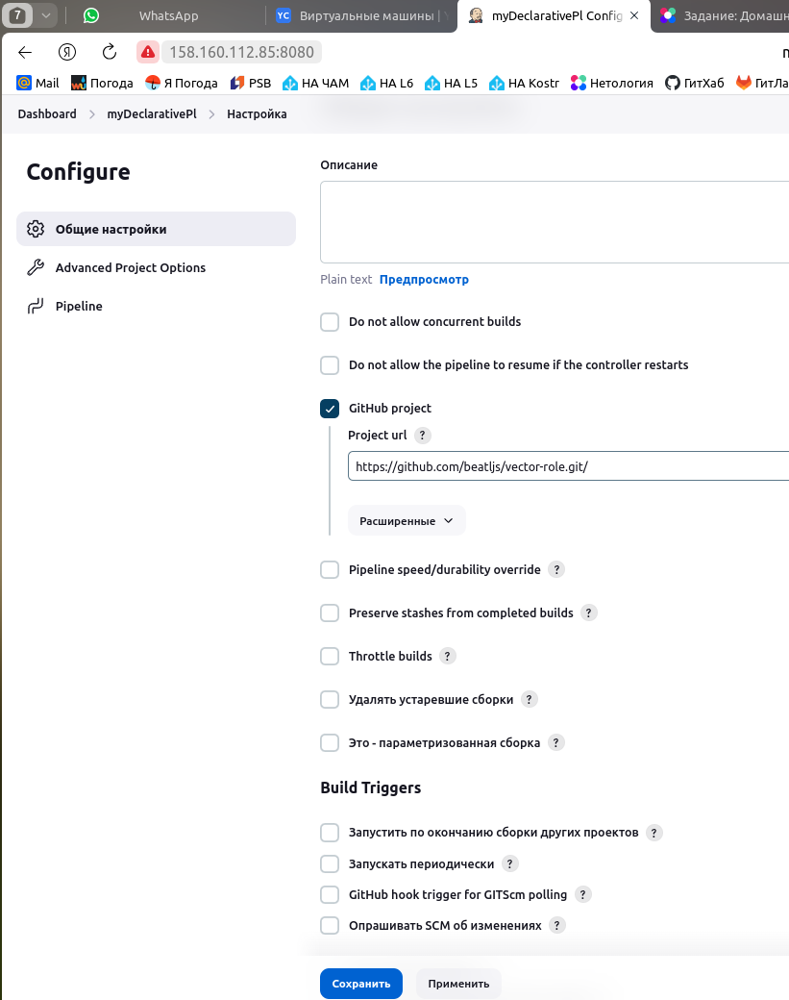

</details>
<details>
    <summary> Скриншот настройки `Declarative Pipeline Job` (часть 2)...  </summary>

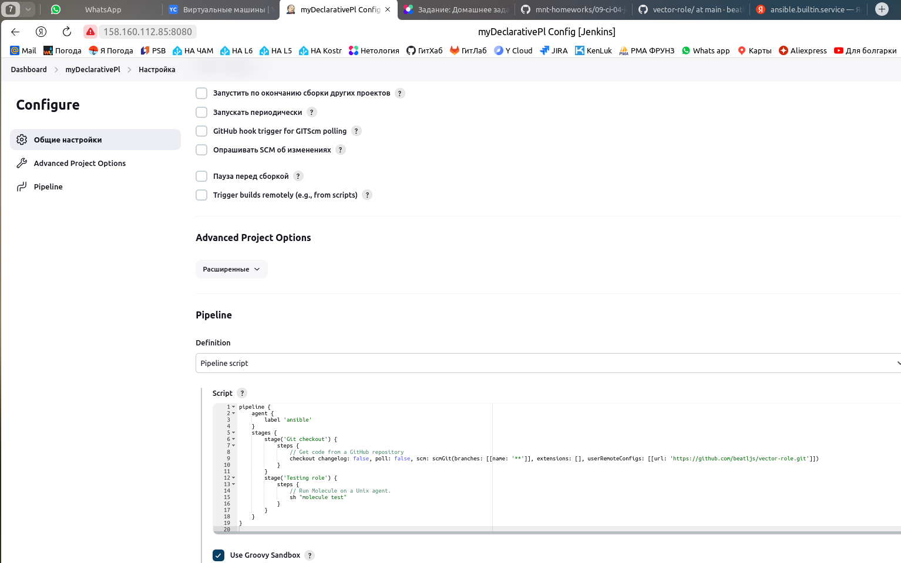

</details>
<details>
    <summary> Шаги сборки `Declarative Pipeline Job`...  </summary>

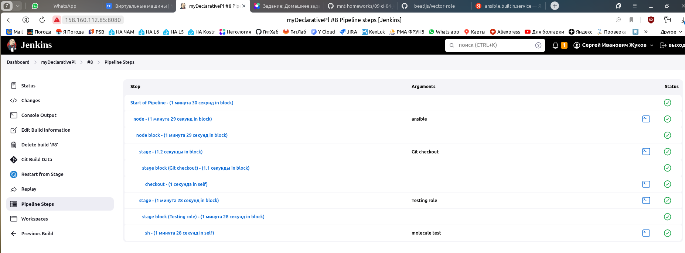

</details>

<details>
    <summary> Stages успешной сборки `Declarative Pipeline Job` ...  </summary>

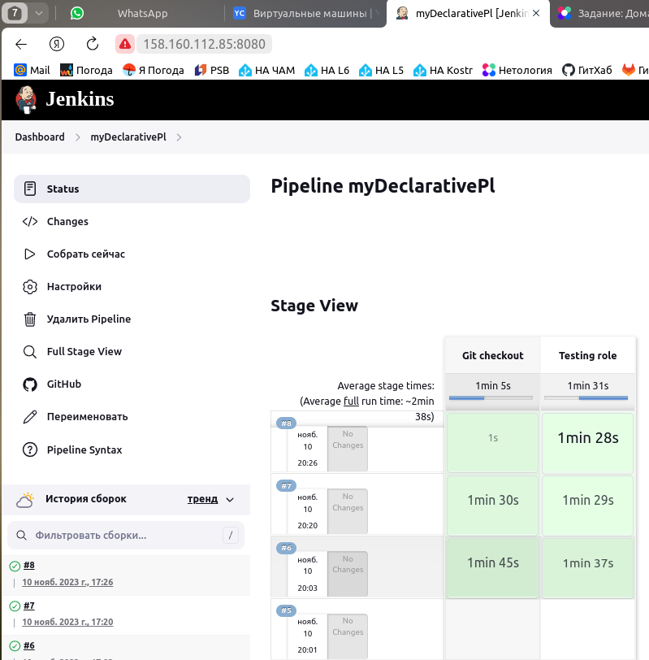
</details>

<details>
    <summary> Log успешной сборки `Declarative Pipeline Job` ...  </summary>

```
Started by user Сергей Иванович Жуков
[Pipeline] Start of Pipeline
[Pipeline] node
Running on nodeagent in /home/jenkins/workspace/myDeclarativePl
[Pipeline] {
[Pipeline] stage
[Pipeline] { (Git checkout)
[Pipeline] checkout
The recommended git tool is: NONE
No credentials specified
Fetching changes from the remote Git repository
 > git rev-parse --resolve-git-dir /home/jenkins/workspace/myDeclarativePl/.git # timeout=10
 > git config remote.origin.url https://github.com/beatljs/vector-role.git # timeout=10
Fetching upstream changes from https://github.com/beatljs/vector-role.git
 > git --version # timeout=10
 > git --version # 'git version 1.8.3.1'
 > git fetch --tags --progress https://github.com/beatljs/vector-role.git +refs/heads/*:refs/remotes/origin/* # timeout=10
Seen branch in repository origin/main
Seen 1 remote branch
 > git show-ref --tags -d # timeout=10
Checking out Revision efb64e5c2bf371ede852e49421b9d4a66bed4e27 (origin/main)
Commit message: "Create Jenkinsfile"
[Pipeline] }
[Pipeline] // stage
[Pipeline] stage
[Pipeline] { (Testing role)
[Pipeline] sh
+ molecule test
 > git config core.sparsecheckout # timeout=10
 > git checkout -f efb64e5c2bf371ede852e49421b9d4a66bed4e27 # timeout=10
/usr/local/lib/python3.6/site-packages/ansible/parsing/vault/__init__.py:44: CryptographyDeprecationWarning: Python 3.6 is no longer supported by the Python core team. Therefore, support for it is deprecated in cryptography. The next release of cryptography will remove support for Python 3.6.
  from cryptography.exceptions import InvalidSignature
/home/jenkins/.local/lib/python3.6/site-packages/requests/__init__.py:104: RequestsDependencyWarning: urllib3 (1.26.18) or chardet (5.0.0)/charset_normalizer (2.0.12) doesn't match a supported version!
  RequestsDependencyWarning)
INFO     default scenario test matrix: dependency, lint, cleanup, destroy, syntax, create, prepare, converge, idempotence, side_effect, verify, cleanup, destroy
INFO     Performing prerun...
INFO     Set ANSIBLE_LIBRARY=/home/jenkins/.cache/ansible-compat/d22754/modules:/home/jenkins/.ansible/plugins/modules:/usr/share/ansible/plugins/modules
INFO     Set ANSIBLE_COLLECTIONS_PATH=/home/jenkins/.cache/ansible-compat/d22754/collections:/home/jenkins/.ansible/collections:/usr/share/ansible/collections
INFO     Set ANSIBLE_ROLES_PATH=/home/jenkins/.cache/ansible-compat/d22754/roles:/home/jenkins/.ansible/roles:/usr/share/ansible/roles:/etc/ansible/roles
INFO     Using /home/jenkins/.ansible/roles/sergey.vector_role symlink to current repository in order to enable Ansible to find the role using its expected full name.
INFO     Running default > dependency
WARNING  Skipping, missing the requirements file.
WARNING  Skipping, missing the requirements file.
INFO     Running default > lint
/usr/local/lib/python3.6/site-packages/ansible/parsing/vault/__init__.py:44: CryptographyDeprecationWarning: Python 3.6 is no longer supported by the Python core team. Therefore, support for it is deprecated in cryptography. The next release of cryptography will remove support for Python 3.6.
  from cryptography.exceptions import InvalidSignature
WARNING: PATH altered to include /usr/bin
WARNING  /usr/local/lib/python3.6/site-packages/ansible/parsing/vault/__init__.py:44: CryptographyDeprecationWarning: Python 3.6 is no longer supported by the Python core team. Therefore, support for it is deprecated in cryptography. The next release of cryptography will remove support for Python 3.6.
  from cryptography.exceptions import InvalidSignature

WARNING  Loading custom .yamllint config file, this extends our internal yamllint config.
INFO     Running default > cleanup
WARNING  Skipping, cleanup playbook not configured.
INFO     Running default > destroy
INFO     Sanity checks: 'docker'

PLAY [Destroy] *****************************************************************

TASK [Destroy molecule instance(s)] ********************************************
/usr/local/lib/python3.6/site-packages/ansible/parsing/vault/__init__.py:44: CryptographyDeprecationWarning: Python 3.6 is no longer supported by the Python core team. Therefore, support for it is deprecated in cryptography. The next release of cryptography will remove support for Python 3.6.
  from cryptography.exceptions import InvalidSignature
changed: [localhost] => (item=pyubuntu)

TASK [Wait for instance(s) deletion to complete] *******************************
FAILED - RETRYING: Wait for instance(s) deletion to complete (300 retries left).
ok: [localhost] => (item=pyubuntu)

TASK [Delete docker networks(s)] ***********************************************

PLAY RECAP *********************************************************************
localhost                  : ok=2    changed=1    unreachable=0    failed=0    skipped=1    rescued=0    ignored=0

INFO     Running default > syntax

playbook: /home/jenkins/workspace/myDeclarativePl/molecule/default/converge.yml
/usr/local/lib/python3.6/site-packages/ansible/parsing/vault/__init__.py:44: CryptographyDeprecationWarning: Python 3.6 is no longer supported by the Python core team. Therefore, support for it is deprecated in cryptography. The next release of cryptography will remove support for Python 3.6.
  from cryptography.exceptions import InvalidSignature
INFO     Running default > create

PLAY [Create] ******************************************************************

TASK [Log into a Docker registry] **********************************************
/usr/local/lib/python3.6/site-packages/ansible/parsing/vault/__init__.py:44: CryptographyDeprecationWarning: Python 3.6 is no longer supported by the Python core team. Therefore, support for it is deprecated in cryptography. The next release of cryptography will remove support for Python 3.6.
  from cryptography.exceptions import InvalidSignature
skipping: [localhost] => (item=None)
skipping: [localhost]

TASK [Check presence of custom Dockerfiles] ************************************
ok: [localhost] => (item={'command': 'systemd', 'image': 'beatljs/pyubuntu:systemd', 'name': 'pyubuntu', 'privileged': True})

TASK [Create Dockerfiles from image names] *************************************
changed: [localhost] => (item={'command': 'systemd', 'image': 'beatljs/pyubuntu:systemd', 'name': 'pyubuntu', 'privileged': True})

TASK [Discover local Docker images] ********************************************
ok: [localhost] => (item={'diff': [], 'dest': '/home/jenkins/.cache/molecule/myDeclarativePl/default/Dockerfile_beatljs_pyubuntu_systemd', 'src': '/home/jenkins/.ansible/tmp/ansible-tmp-1699637230.0065885-8928-59843552795225/source', 'md5sum': '3fdf51a4e575e714a1183c70787a1dba', 'checksum': '69932a0fdd4289ad38a5d68027b8816193c0235b', 'changed': True, 'uid': 1000, 'gid': 1001, 'owner': 'jenkins', 'group': 'jenkins', 'mode': '0600', 'state': 'file', 'size': 1053, 'invocation': {'module_args': {'src': '/home/jenkins/.ansible/tmp/ansible-tmp-1699637230.0065885-8928-59843552795225/source', 'dest': '/home/jenkins/.cache/molecule/myDeclarativePl/default/Dockerfile_beatljs_pyubuntu_systemd', 'mode': '0600', 'follow': False, '_original_basename': 'Dockerfile.j2', 'checksum': '69932a0fdd4289ad38a5d68027b8816193c0235b', 'backup': False, 'force': True, 'unsafe_writes': False, 'content': None, 'validate': None, 'directory_mode': None, 'remote_src': None, 'local_follow': None, 'owner': None, 'group': None, 'seuser': None, 'serole': None, 'selevel': None, 'setype': None, 'attributes': None}}, 'failed': False, 'item': {'command': 'systemd', 'image': 'beatljs/pyubuntu:systemd', 'name': 'pyubuntu', 'privileged': True}, 'ansible_loop_var': 'item', 'i': 0, 'ansible_index_var': 'i'})

TASK [Build an Ansible compatible image (new)] *********************************
ok: [localhost] => (item=molecule_local/beatljs/pyubuntu:systemd)

TASK [Create docker network(s)] ************************************************

TASK [Determine the CMD directives] ********************************************
ok: [localhost] => (item={'command': 'systemd', 'image': 'beatljs/pyubuntu:systemd', 'name': 'pyubuntu', 'privileged': True})

TASK [Create molecule instance(s)] *********************************************
changed: [localhost] => (item=pyubuntu)

TASK [Wait for instance(s) creation to complete] *******************************
FAILED - RETRYING: Wait for instance(s) creation to complete (300 retries left).
changed: [localhost] => (item={'started': 1, 'finished': 0, 'ansible_job_id': '151071408162.9063', 'results_file': '/home/jenkins/.ansible_async/151071408162.9063', 'changed': True, 'failed': False, 'item': {'command': 'systemd', 'image': 'beatljs/pyubuntu:systemd', 'name': 'pyubuntu', 'privileged': True}, 'ansible_loop_var': 'item'})

PLAY RECAP *********************************************************************
localhost                  : ok=7    changed=3    unreachable=0    failed=0    skipped=2    rescued=0    ignored=0

INFO     Running default > prepare
WARNING  Skipping, prepare playbook not configured.
INFO     Running default > converge

PLAY [Converge] ****************************************************************

TASK [Gathering Facts] *********************************************************
/usr/local/lib/python3.6/site-packages/ansible/parsing/vault/__init__.py:44: CryptographyDeprecationWarning: Python 3.6 is no longer supported by the Python core team. Therefore, support for it is deprecated in cryptography. The next release of cryptography will remove support for Python 3.6.
  from cryptography.exceptions import InvalidSignature
ok: [pyubuntu]

TASK [Include vector-role] *****************************************************

TASK [sergey.vector_role : Create temp directory] ******************************
--- before
+++ after
@@ -1,4 +1,4 @@
 {
     "path": "/home/jenkins/workspace/myDeclarativePl/molecule/default/tmpd",
-    "state": "absent"
+    "state": "directory"
 }

changed: [pyubuntu]

TASK [sergey.vector_role : Get vector distrib] *********************************
changed: [pyubuntu]

TASK [sergey.vector_role : Create root directory] ******************************
--- before
+++ after
@@ -1,4 +1,4 @@
 {
     "path": "/home/jenkins/workspace/myDeclarativePl/molecule/default/tmpd/vector-0.29.1",
-    "state": "absent"
+    "state": "directory"
 }

changed: [pyubuntu]

TASK [sergey.vector_role : Extract vector] *************************************
changed: [pyubuntu]

TASK [sergey.vector_role : Copy vector to bin with owner and permissions] ******
changed: [pyubuntu]

TASK [sergey.vector_role : Configure vector.service from template] *************
--- before
+++ after: /home/jenkins/.ansible/tmp/ansible-local-92755_gx5mpj/tmpl6nk1226/vector.service.j2
@@ -0,0 +1,18 @@
+[Unit]
+Description=Vector
+Documentation=https://vector.dev
+After=network-online.target
+Requires=network-online.target
+
+[Service]
+User=root
+Group=0
+ExecStartPre=/usr/bin/vector validate --no-environment --config-yaml /home/jenkins/workspace/myDeclarativePl/molecule/default/v_conf/vector.yml
+ExecStart=/usr/bin/vector --config-yaml /home/jenkins/workspace/myDeclarativePl/molecule/default/v_conf/vector.yml --watch-config
+ExecReload=/usr/bin/vector validate --no-environment --config-yaml /home/jenkins/workspace/myDeclarativePl/molecule/default/v_conf/vector.yml
+Restart=no
+AmbientCapabilities=CAP_NET_BIND_SERVICE
+EnvironmentFile=-/etc/default/vector
+
+[Install]
+WantedBy=multi-user.target
\ No newline at end of file

changed: [pyubuntu]

TASK [sergey.vector_role : Create config dir for vector] ***********************
--- before
+++ after
@@ -1,5 +1,5 @@
 {
-    "mode": "0755",
+    "mode": "0644",
     "path": "/home/jenkins/workspace/myDeclarativePl/molecule/default/v_conf",
-    "state": "absent"
+    "state": "directory"
 }

changed: [pyubuntu]

TASK [sergey.vector_role : Configure vector from template] *********************
--- before
+++ after: /home/jenkins/.ansible/tmp/ansible-local-92755_gx5mpj/tmp_8_cy351/vector.yml.j2
@@ -0,0 +1,20 @@
+data_dir: /var/lib/vector
+sinks:
+    to_clickhouse:
+        compression: gzip
+        database: logs
+        endpoint: http://127.0.0.1:8123
+        inputs:
+        - sample_file
+        skip_unknown_fields: true
+        table: local_log
+        type: clickhouse
+sources:
+    sample_file:
+        ignore_older_secs: 600
+        include:
+        - /var/log/**/*.log
+        read_from: beginning
+        type: file
+    vector_log:
+        type: internal_logs

changed: [pyubuntu]

TASK [sergey.vector_role : Create data directory] ******************************
--- before
+++ after
@@ -1,5 +1,5 @@
 {
-    "mode": "0755",
+    "mode": "0777",
     "path": "/var/lib/vector",
-    "state": "absent"
+    "state": "directory"
 }

changed: [pyubuntu]

RUNNING HANDLER [sergey.vector_role : Restart Vector service] ******************
changed: [pyubuntu]

PLAY RECAP *********************************************************************
pyubuntu                   : ok=11   changed=10   unreachable=0    failed=0    skipped=0    rescued=0    ignored=0

INFO     Running default > idempotence

PLAY [Converge] ****************************************************************

TASK [Gathering Facts] *********************************************************
/usr/local/lib/python3.6/site-packages/ansible/parsing/vault/__init__.py:44: CryptographyDeprecationWarning: Python 3.6 is no longer supported by the Python core team. Therefore, support for it is deprecated in cryptography. The next release of cryptography will remove support for Python 3.6.
  from cryptography.exceptions import InvalidSignature
ok: [pyubuntu]

TASK [Include vector-role] *****************************************************

TASK [sergey.vector_role : Create temp directory] ******************************
ok: [pyubuntu]

TASK [sergey.vector_role : Get vector distrib] *********************************
ok: [pyubuntu]

TASK [sergey.vector_role : Create root directory] ******************************
ok: [pyubuntu]

TASK [sergey.vector_role : Extract vector] *************************************
ok: [pyubuntu]

TASK [sergey.vector_role : Copy vector to bin with owner and permissions] ******
ok: [pyubuntu]

TASK [sergey.vector_role : Configure vector.service from template] *************
ok: [pyubuntu]

TASK [sergey.vector_role : Create config dir for vector] ***********************
ok: [pyubuntu]

TASK [sergey.vector_role : Configure vector from template] *********************
ok: [pyubuntu]

TASK [sergey.vector_role : Create data directory] ******************************
ok: [pyubuntu]

PLAY RECAP *********************************************************************
pyubuntu                   : ok=10   changed=0    unreachable=0    failed=0    skipped=0    rescued=0    ignored=0

INFO     Idempotence completed successfully.
INFO     Running default > side_effect
WARNING  Skipping, side effect playbook not configured.
INFO     Running default > verify
INFO     Running Ansible Verifier

PLAY [Verify] ******************************************************************

TASK [Get Vector version] ******************************************************
/usr/local/lib/python3.6/site-packages/ansible/parsing/vault/__init__.py:44: CryptographyDeprecationWarning: Python 3.6 is no longer supported by the Python core team. Therefore, support for it is deprecated in cryptography. The next release of cryptography will remove support for Python 3.6.
  from cryptography.exceptions import InvalidSignature
ok: [pyubuntu]

TASK [Assert Vector instalation] ***********************************************
ok: [pyubuntu] => {
    "changed": false,
    "msg": "All assertions passed"
}

TASK [Validation Vector configuration] *****************************************
ok: [pyubuntu]

TASK [Assert Vector validate config] *******************************************
ok: [pyubuntu] => {
    "changed": false,
    "msg": "All assertions passed"
}

PLAY RECAP *********************************************************************
pyubuntu                   : ok=4    changed=0    unreachable=0    failed=0    skipped=0    rescued=0    ignored=0

INFO     Verifier completed successfully.
INFO     Running default > cleanup
WARNING  Skipping, cleanup playbook not configured.
INFO     Running default > destroy

PLAY [Destroy] *****************************************************************

TASK [Destroy molecule instance(s)] ********************************************
/usr/local/lib/python3.6/site-packages/ansible/parsing/vault/__init__.py:44: CryptographyDeprecationWarning: Python 3.6 is no longer supported by the Python core team. Therefore, support for it is deprecated in cryptography. The next release of cryptography will remove support for Python 3.6.
  from cryptography.exceptions import InvalidSignature
changed: [localhost] => (item=pyubuntu)

TASK [Wait for instance(s) deletion to complete] *******************************
FAILED - RETRYING: Wait for instance(s) deletion to complete (300 retries left).
changed: [localhost] => (item=pyubuntu)

TASK [Delete docker networks(s)] ***********************************************

PLAY RECAP *********************************************************************
localhost                  : ok=2    changed=2    unreachable=0    failed=0    skipped=1    rescued=0    ignored=0

INFO     Pruning extra files from scenario ephemeral directory
[Pipeline] }
[Pipeline] // stage
[Pipeline] }
[Pipeline] // node
[Pipeline] End of Pipeline
Finished: SUCCESS
```

</details>

---

###### part3
### Файлы к 3 пункту ДЗ

`Jenkinsfile` в репозитории с `role`: [Jenkisfile](https://github.com/beatljs/vector-role/blob/main/Jenkinsfile)

---

###### part4
### Cкриншоты к 4 пункту ДЗ

<details>
    <summary> Скриншот настройки `Multibranch Pipeline Job` (часть 1)...  </summary>

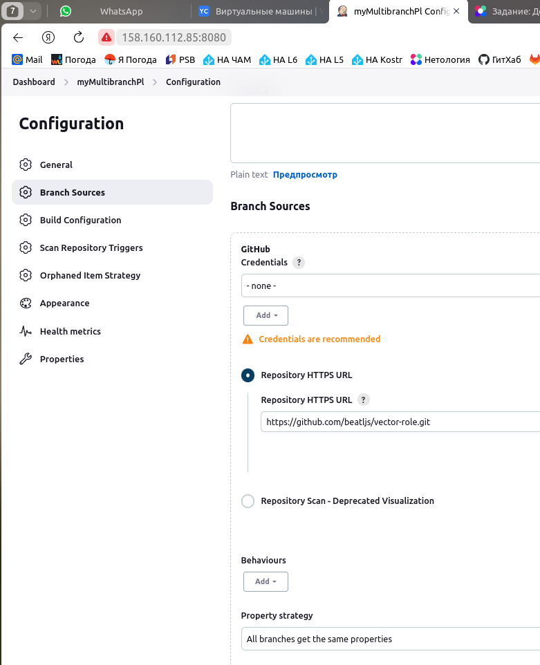

</details>
<details>
    <summary> Скриншот настройки `Multibranch Pipeline Job` (часть 2)...  </summary>

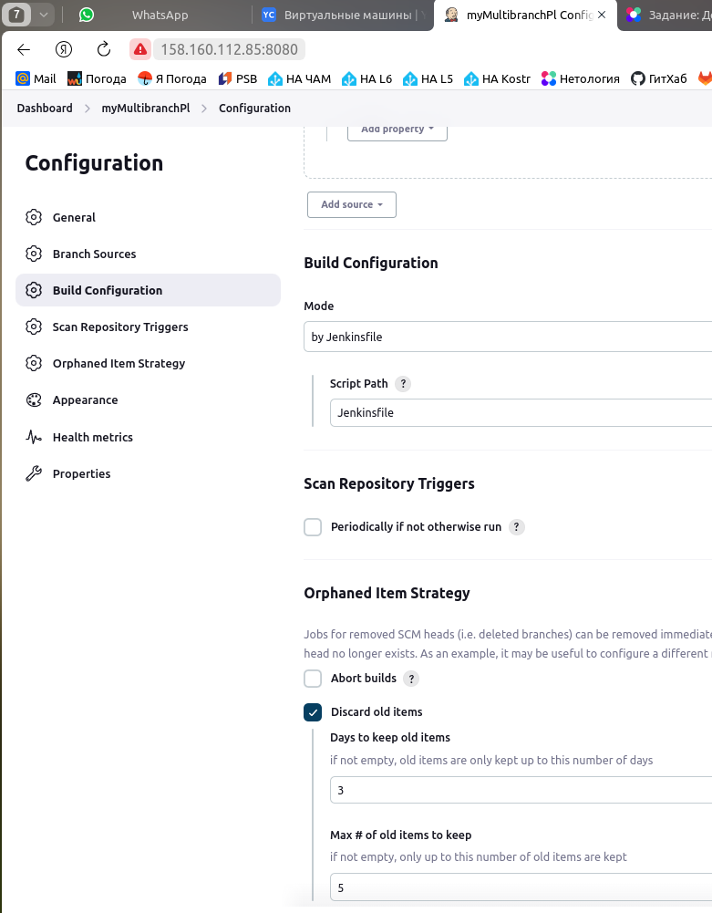

</details>

<details>
    <summary> Dashboard `Multibranch Pipeline Job`...  </summary>

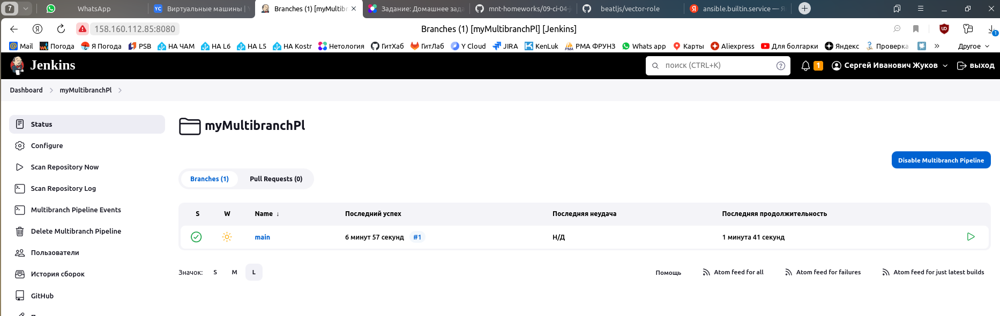

</details>

<details>
    <summary> Stages успешной сборки `Multibranch Pipeline Job` ...  </summary>

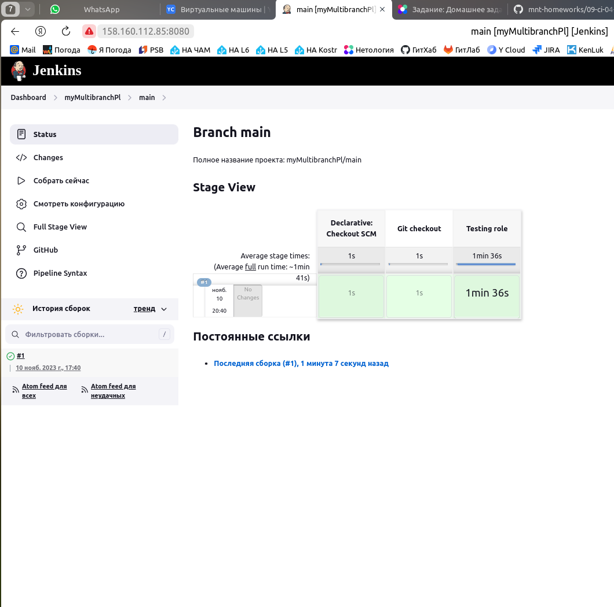

</details>

<details>
    <summary> Log успешной сборки `Multibranch Pipeline Job` ...  </summary>

```
Branch indexing
17:40:13 Connecting to https://api.github.com with no credentials, anonymous access
Obtained Jenkinsfile from efb64e5c2bf371ede852e49421b9d4a66bed4e27
[Pipeline] Start of Pipeline
[Pipeline] node
Running on nodeagent in /home/jenkins/workspace/myMultibranchPl_main
[Pipeline] {
[Pipeline] stage
[Pipeline] { (Declarative: Checkout SCM)
[Pipeline] checkout
The recommended git tool is: NONE
No credentials specified
Cloning the remote Git repository
Cloning with configured refspecs honoured and without tags
Avoid second fetch
Checking out Revision efb64e5c2bf371ede852e49421b9d4a66bed4e27 (main)
Cloning repository https://github.com/beatljs/vector-role.git
 > git init /home/jenkins/workspace/myMultibranchPl_main # timeout=10
Fetching upstream changes from https://github.com/beatljs/vector-role.git
 > git --version # timeout=10
 > git --version # 'git version 1.8.3.1'
 > git fetch --no-tags --progress https://github.com/beatljs/vector-role.git +refs/heads/main:refs/remotes/origin/main # timeout=10
 > git config remote.origin.url https://github.com/beatljs/vector-role.git # timeout=10
 > git config --add remote.origin.fetch +refs/heads/main:refs/remotes/origin/main # timeout=10
 > git config core.sparsecheckout # timeout=10
Commit message: "Create Jenkinsfile"
First time build. Skipping changelog.
[Pipeline] }
[Pipeline] // stage
[Pipeline] withEnv
[Pipeline] {
[Pipeline] stage
[Pipeline] { (Git checkout)
[Pipeline] checkout
The recommended git tool is: NONE
No credentials specified
Fetching changes from the remote Git repository
 > git checkout -f efb64e5c2bf371ede852e49421b9d4a66bed4e27 # timeout=10
 > git rev-parse --resolve-git-dir /home/jenkins/workspace/myMultibranchPl_main/.git # timeout=10
 > git config remote.origin.url https://github.com/beatljs/vector-role.git # timeout=10
Fetching upstream changes from https://github.com/beatljs/vector-role.git
 > git --version # timeout=10
 > git --version # 'git version 1.8.3.1'
 > git fetch --tags --progress https://github.com/beatljs/vector-role.git +refs/heads/*:refs/remotes/origin/* # timeout=10
Seen branch in repository origin/main
Seen 1 remote branch
 > git show-ref --tags -d # timeout=10
Checking out Revision efb64e5c2bf371ede852e49421b9d4a66bed4e27 (origin/main)
Commit message: "Create Jenkinsfile"
[Pipeline] }
[Pipeline] // stage
[Pipeline] stage
[Pipeline] { (Testing role)
[Pipeline] sh
+ molecule test
 > git config core.sparsecheckout # timeout=10
 > git checkout -f efb64e5c2bf371ede852e49421b9d4a66bed4e27 # timeout=10
/usr/local/lib/python3.6/site-packages/ansible/parsing/vault/__init__.py:44: CryptographyDeprecationWarning: Python 3.6 is no longer supported by the Python core team. Therefore, support for it is deprecated in cryptography. The next release of cryptography will remove support for Python 3.6.
  from cryptography.exceptions import InvalidSignature
/home/jenkins/.local/lib/python3.6/site-packages/requests/__init__.py:104: RequestsDependencyWarning: urllib3 (1.26.18) or chardet (5.0.0)/charset_normalizer (2.0.12) doesn't match a supported version!
  RequestsDependencyWarning)
INFO     default scenario test matrix: dependency, lint, cleanup, destroy, syntax, create, prepare, converge, idempotence, side_effect, verify, cleanup, destroy
INFO     Performing prerun...
INFO     Set ANSIBLE_LIBRARY=/home/jenkins/.cache/ansible-compat/8601ff/modules:/home/jenkins/.ansible/plugins/modules:/usr/share/ansible/plugins/modules
INFO     Set ANSIBLE_COLLECTIONS_PATH=/home/jenkins/.cache/ansible-compat/8601ff/collections:/home/jenkins/.ansible/collections:/usr/share/ansible/collections
INFO     Set ANSIBLE_ROLES_PATH=/home/jenkins/.cache/ansible-compat/8601ff/roles:/home/jenkins/.ansible/roles:/usr/share/ansible/roles:/etc/ansible/roles
INFO     Using /home/jenkins/.ansible/roles/sergey.vector_role symlink to current repository in order to enable Ansible to find the role using its expected full name.
INFO     Running default > dependency
INFO     Running ansible-galaxy collection install -v --force community.docker:>=1.9.1
WARNING  Skipping, missing the requirements file.
WARNING  Skipping, missing the requirements file.
INFO     Running default > lint
/usr/local/lib/python3.6/site-packages/ansible/parsing/vault/__init__.py:44: CryptographyDeprecationWarning: Python 3.6 is no longer supported by the Python core team. Therefore, support for it is deprecated in cryptography. The next release of cryptography will remove support for Python 3.6.
  from cryptography.exceptions import InvalidSignature
WARNING: PATH altered to include /usr/bin
WARNING  /usr/local/lib/python3.6/site-packages/ansible/parsing/vault/__init__.py:44: CryptographyDeprecationWarning: Python 3.6 is no longer supported by the Python core team. Therefore, support for it is deprecated in cryptography. The next release of cryptography will remove support for Python 3.6.
  from cryptography.exceptions import InvalidSignature

WARNING  Loading custom .yamllint config file, this extends our internal yamllint config.
INFO     Running default > cleanup
WARNING  Skipping, cleanup playbook not configured.
INFO     Running default > destroy
INFO     Sanity checks: 'docker'

PLAY [Destroy] *****************************************************************

TASK [Destroy molecule instance(s)] ********************************************
/usr/local/lib/python3.6/site-packages/ansible/parsing/vault/__init__.py:44: CryptographyDeprecationWarning: Python 3.6 is no longer supported by the Python core team. Therefore, support for it is deprecated in cryptography. The next release of cryptography will remove support for Python 3.6.
  from cryptography.exceptions import InvalidSignature
changed: [localhost] => (item=pyubuntu)

TASK [Wait for instance(s) deletion to complete] *******************************
FAILED - RETRYING: Wait for instance(s) deletion to complete (300 retries left).
ok: [localhost] => (item=pyubuntu)

TASK [Delete docker networks(s)] ***********************************************

PLAY RECAP *********************************************************************
localhost                  : ok=2    changed=1    unreachable=0    failed=0    skipped=1    rescued=0    ignored=0

INFO     Running default > syntax

playbook: /home/jenkins/workspace/myMultibranchPl_main/molecule/default/converge.yml
/usr/local/lib/python3.6/site-packages/ansible/parsing/vault/__init__.py:44: CryptographyDeprecationWarning: Python 3.6 is no longer supported by the Python core team. Therefore, support for it is deprecated in cryptography. The next release of cryptography will remove support for Python 3.6.
  from cryptography.exceptions import InvalidSignature
INFO     Running default > create

PLAY [Create] ******************************************************************

TASK [Log into a Docker registry] **********************************************
/usr/local/lib/python3.6/site-packages/ansible/parsing/vault/__init__.py:44: CryptographyDeprecationWarning: Python 3.6 is no longer supported by the Python core team. Therefore, support for it is deprecated in cryptography. The next release of cryptography will remove support for Python 3.6.
  from cryptography.exceptions import InvalidSignature
skipping: [localhost] => (item=None)
skipping: [localhost]

TASK [Check presence of custom Dockerfiles] ************************************
ok: [localhost] => (item={'command': 'systemd', 'image': 'beatljs/pyubuntu:systemd', 'name': 'pyubuntu', 'privileged': True})

TASK [Create Dockerfiles from image names] *************************************
changed: [localhost] => (item={'command': 'systemd', 'image': 'beatljs/pyubuntu:systemd', 'name': 'pyubuntu', 'privileged': True})

TASK [Discover local Docker images] ********************************************
ok: [localhost] => (item={'diff': [], 'dest': '/home/jenkins/.cache/molecule/myMultibranchPl_main/default/Dockerfile_beatljs_pyubuntu_systemd', 'src': '/home/jenkins/.ansible/tmp/ansible-tmp-1699638047.4036896-14765-168268687392929/source', 'md5sum': '3fdf51a4e575e714a1183c70787a1dba', 'checksum': '69932a0fdd4289ad38a5d68027b8816193c0235b', 'changed': True, 'uid': 1000, 'gid': 1001, 'owner': 'jenkins', 'group': 'jenkins', 'mode': '0600', 'state': 'file', 'size': 1053, 'invocation': {'module_args': {'src': '/home/jenkins/.ansible/tmp/ansible-tmp-1699638047.4036896-14765-168268687392929/source', 'dest': '/home/jenkins/.cache/molecule/myMultibranchPl_main/default/Dockerfile_beatljs_pyubuntu_systemd', 'mode': '0600', 'follow': False, '_original_basename': 'Dockerfile.j2', 'checksum': '69932a0fdd4289ad38a5d68027b8816193c0235b', 'backup': False, 'force': True, 'unsafe_writes': False, 'content': None, 'validate': None, 'directory_mode': None, 'remote_src': None, 'local_follow': None, 'owner': None, 'group': None, 'seuser': None, 'serole': None, 'selevel': None, 'setype': None, 'attributes': None}}, 'failed': False, 'item': {'command': 'systemd', 'image': 'beatljs/pyubuntu:systemd', 'name': 'pyubuntu', 'privileged': True}, 'ansible_loop_var': 'item', 'i': 0, 'ansible_index_var': 'i'})

TASK [Build an Ansible compatible image (new)] *********************************
ok: [localhost] => (item=molecule_local/beatljs/pyubuntu:systemd)

TASK [Create docker network(s)] ************************************************

TASK [Determine the CMD directives] ********************************************
ok: [localhost] => (item={'command': 'systemd', 'image': 'beatljs/pyubuntu:systemd', 'name': 'pyubuntu', 'privileged': True})

TASK [Create molecule instance(s)] *********************************************
changed: [localhost] => (item=pyubuntu)

TASK [Wait for instance(s) creation to complete] *******************************
FAILED - RETRYING: Wait for instance(s) creation to complete (300 retries left).
changed: [localhost] => (item={'started': 1, 'finished': 0, 'ansible_job_id': '521740869464.14903', 'results_file': '/home/jenkins/.ansible_async/521740869464.14903', 'changed': True, 'failed': False, 'item': {'command': 'systemd', 'image': 'beatljs/pyubuntu:systemd', 'name': 'pyubuntu', 'privileged': True}, 'ansible_loop_var': 'item'})

PLAY RECAP *********************************************************************
localhost                  : ok=7    changed=3    unreachable=0    failed=0    skipped=2    rescued=0    ignored=0

INFO     Running default > prepare
WARNING  Skipping, prepare playbook not configured.
INFO     Running default > converge

PLAY [Converge] ****************************************************************

TASK [Gathering Facts] *********************************************************
/usr/local/lib/python3.6/site-packages/ansible/parsing/vault/__init__.py:44: CryptographyDeprecationWarning: Python 3.6 is no longer supported by the Python core team. Therefore, support for it is deprecated in cryptography. The next release of cryptography will remove support for Python 3.6.
  from cryptography.exceptions import InvalidSignature
ok: [pyubuntu]

TASK [Include vector-role] *****************************************************

TASK [sergey.vector_role : Create temp directory] ******************************
--- before
+++ after
@@ -1,4 +1,4 @@
 {
     "path": "/home/jenkins/workspace/myMultibranchPl_main/molecule/default/tmpd",
-    "state": "absent"
+    "state": "directory"
 }

changed: [pyubuntu]

TASK [sergey.vector_role : Get vector distrib] *********************************
changed: [pyubuntu]

TASK [sergey.vector_role : Create root directory] ******************************
--- before
+++ after
@@ -1,4 +1,4 @@
 {
     "path": "/home/jenkins/workspace/myMultibranchPl_main/molecule/default/tmpd/vector-0.29.1",
-    "state": "absent"
+    "state": "directory"
 }

changed: [pyubuntu]

TASK [sergey.vector_role : Extract vector] *************************************
changed: [pyubuntu]

TASK [sergey.vector_role : Copy vector to bin with owner and permissions] ******
changed: [pyubuntu]

TASK [sergey.vector_role : Configure vector.service from template] *************
--- before
+++ after: /home/jenkins/.ansible/tmp/ansible-local-151210a_n7990/tmpirhe4u6a/vector.service.j2
@@ -0,0 +1,18 @@
+[Unit]
+Description=Vector
+Documentation=https://vector.dev
+After=network-online.target
+Requires=network-online.target
+
+[Service]
+User=root
+Group=0
+ExecStartPre=/usr/bin/vector validate --no-environment --config-yaml /home/jenkins/workspace/myMultibranchPl_main/molecule/default/v_conf/vector.yml
+ExecStart=/usr/bin/vector --config-yaml /home/jenkins/workspace/myMultibranchPl_main/molecule/default/v_conf/vector.yml --watch-config
+ExecReload=/usr/bin/vector validate --no-environment --config-yaml /home/jenkins/workspace/myMultibranchPl_main/molecule/default/v_conf/vector.yml
+Restart=no
+AmbientCapabilities=CAP_NET_BIND_SERVICE
+EnvironmentFile=-/etc/default/vector
+
+[Install]
+WantedBy=multi-user.target
\ No newline at end of file

changed: [pyubuntu]

TASK [sergey.vector_role : Create config dir for vector] ***********************
--- before
+++ after
@@ -1,5 +1,5 @@
 {
-    "mode": "0755",
+    "mode": "0644",
     "path": "/home/jenkins/workspace/myMultibranchPl_main/molecule/default/v_conf",
-    "state": "absent"
+    "state": "directory"
 }

changed: [pyubuntu]

TASK [sergey.vector_role : Configure vector from template] *********************
--- before
+++ after: /home/jenkins/.ansible/tmp/ansible-local-151210a_n7990/tmpzsvh1cwv/vector.yml.j2
@@ -0,0 +1,20 @@
+data_dir: /var/lib/vector
+sinks:
+    to_clickhouse:
+        compression: gzip
+        database: logs
+        endpoint: http://127.0.0.1:8123
+        inputs:
+        - sample_file
+        skip_unknown_fields: true
+        table: local_log
+        type: clickhouse
+sources:
+    sample_file:
+        ignore_older_secs: 600
+        include:
+        - /var/log/**/*.log
+        read_from: beginning
+        type: file
+    vector_log:
+        type: internal_logs

changed: [pyubuntu]

TASK [sergey.vector_role : Create data directory] ******************************
--- before
+++ after
@@ -1,5 +1,5 @@
 {
-    "mode": "0755",
+    "mode": "0777",
     "path": "/var/lib/vector",
-    "state": "absent"
+    "state": "directory"
 }

changed: [pyubuntu]

RUNNING HANDLER [sergey.vector_role : Restart Vector service] ******************
changed: [pyubuntu]

PLAY RECAP *********************************************************************
pyubuntu                   : ok=11   changed=10   unreachable=0    failed=0    skipped=0    rescued=0    ignored=0

INFO     Running default > idempotence

PLAY [Converge] ****************************************************************

TASK [Gathering Facts] *********************************************************
/usr/local/lib/python3.6/site-packages/ansible/parsing/vault/__init__.py:44: CryptographyDeprecationWarning: Python 3.6 is no longer supported by the Python core team. Therefore, support for it is deprecated in cryptography. The next release of cryptography will remove support for Python 3.6.
  from cryptography.exceptions import InvalidSignature
ok: [pyubuntu]

TASK [Include vector-role] *****************************************************

TASK [sergey.vector_role : Create temp directory] ******************************
ok: [pyubuntu]

TASK [sergey.vector_role : Get vector distrib] *********************************
ok: [pyubuntu]

TASK [sergey.vector_role : Create root directory] ******************************
ok: [pyubuntu]

TASK [sergey.vector_role : Extract vector] *************************************
ok: [pyubuntu]

TASK [sergey.vector_role : Copy vector to bin with owner and permissions] ******
ok: [pyubuntu]

TASK [sergey.vector_role : Configure vector.service from template] *************
ok: [pyubuntu]

TASK [sergey.vector_role : Create config dir for vector] ***********************
ok: [pyubuntu]

TASK [sergey.vector_role : Configure vector from template] *********************
ok: [pyubuntu]

TASK [sergey.vector_role : Create data directory] ******************************
ok: [pyubuntu]

PLAY RECAP *********************************************************************
pyubuntu                   : ok=10   changed=0    unreachable=0    failed=0    skipped=0    rescued=0    ignored=0

INFO     Idempotence completed successfully.
INFO     Running default > side_effect
WARNING  Skipping, side effect playbook not configured.
INFO     Running default > verify
INFO     Running Ansible Verifier

PLAY [Verify] ******************************************************************

TASK [Get Vector version] ******************************************************
/usr/local/lib/python3.6/site-packages/ansible/parsing/vault/__init__.py:44: CryptographyDeprecationWarning: Python 3.6 is no longer supported by the Python core team. Therefore, support for it is deprecated in cryptography. The next release of cryptography will remove support for Python 3.6.
  from cryptography.exceptions import InvalidSignature
ok: [pyubuntu]

TASK [Assert Vector instalation] ***********************************************
ok: [pyubuntu] => {
    "changed": false,
    "msg": "All assertions passed"
}

TASK [Validation Vector configuration] *****************************************
ok: [pyubuntu]

TASK [Assert Vector validate config] *******************************************
ok: [pyubuntu] => {
    "changed": false,
    "msg": "All assertions passed"
}

PLAY RECAP *********************************************************************
pyubuntu                   : ok=4    changed=0    unreachable=0    failed=0    skipped=0    rescued=0    ignored=0

INFO     Verifier completed successfully.
INFO     Running default > cleanup
WARNING  Skipping, cleanup playbook not configured.
INFO     Running default > destroy

PLAY [Destroy] *****************************************************************

TASK [Destroy molecule instance(s)] ********************************************
/usr/local/lib/python3.6/site-packages/ansible/parsing/vault/__init__.py:44: CryptographyDeprecationWarning: Python 3.6 is no longer supported by the Python core team. Therefore, support for it is deprecated in cryptography. The next release of cryptography will remove support for Python 3.6.
  from cryptography.exceptions import InvalidSignature
changed: [localhost] => (item=pyubuntu)

TASK [Wait for instance(s) deletion to complete] *******************************
FAILED - RETRYING: Wait for instance(s) deletion to complete (300 retries left).
changed: [localhost] => (item=pyubuntu)

TASK [Delete docker networks(s)] ***********************************************

PLAY RECAP *********************************************************************
localhost                  : ok=2    changed=2    unreachable=0    failed=0    skipped=1    rescued=0    ignored=0

INFO     Pruning extra files from scenario ephemeral directory
[Pipeline] }
[Pipeline] // stage
[Pipeline] }
[Pipeline] // withEnv
[Pipeline] }
[Pipeline] // node
[Pipeline] End of Pipeline
Finished: SUCCESS
```

</details>

---

###### part5
### Файлы и скриншоты к 5-7 пунктам ДЗ

Ссылка на исправленный Scripted Pipeline:
[ScriptedJenkinsfile](https://github.com/beatljs/vector-role/blob/main/ScriptedJenkinsfile)

<details>
    <summary> Скриншот настройки `Scripted Pipeline Job`...  </summary>

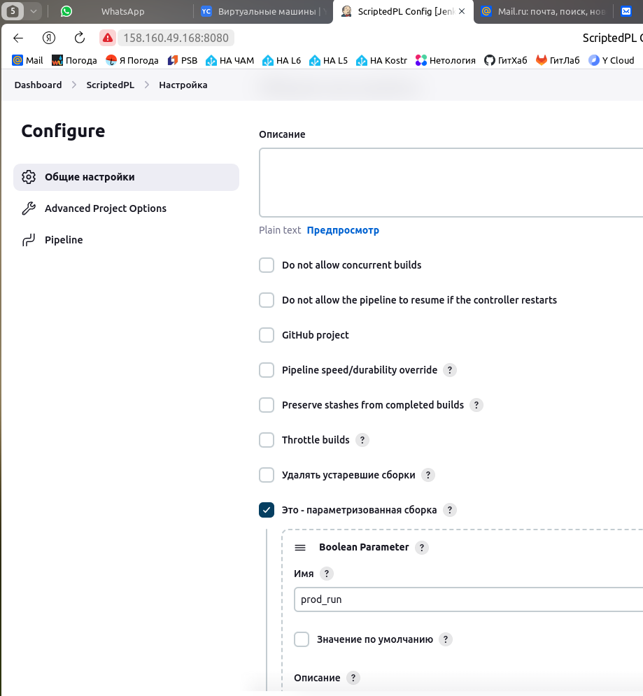

</details>
<details>
    <summary> Скриншот шагов выполнения `Scripted Pipeline Job` при `prod_run=False`...  </summary>


</details>

<details>
    <summary> Скриншот шагов выполнения `Scripted Pipeline Job` при `prod_run=True`...  </summary>

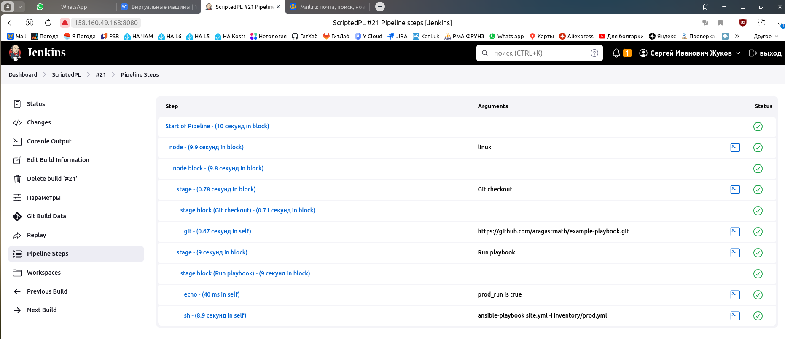

</details>

<details>
    <summary> Stages успешной сборки `Scripted Pipeline Job` ...  </summary>

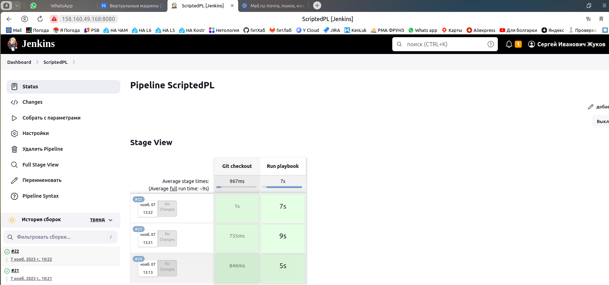

</details>

---

###### Student
### Исполнитель

Сергей Жуков DevOps-32

---