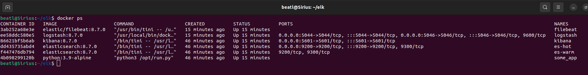
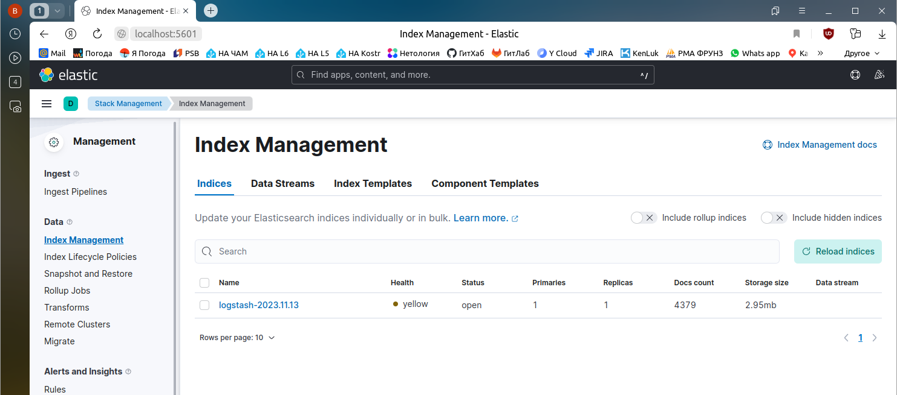
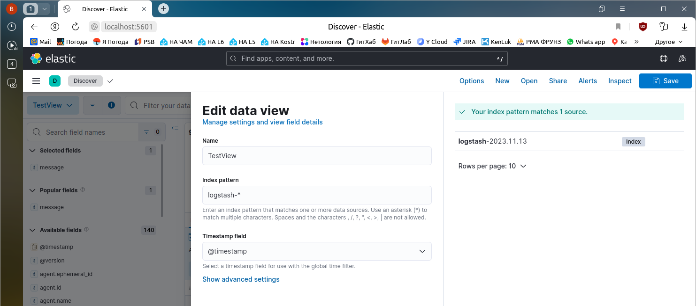
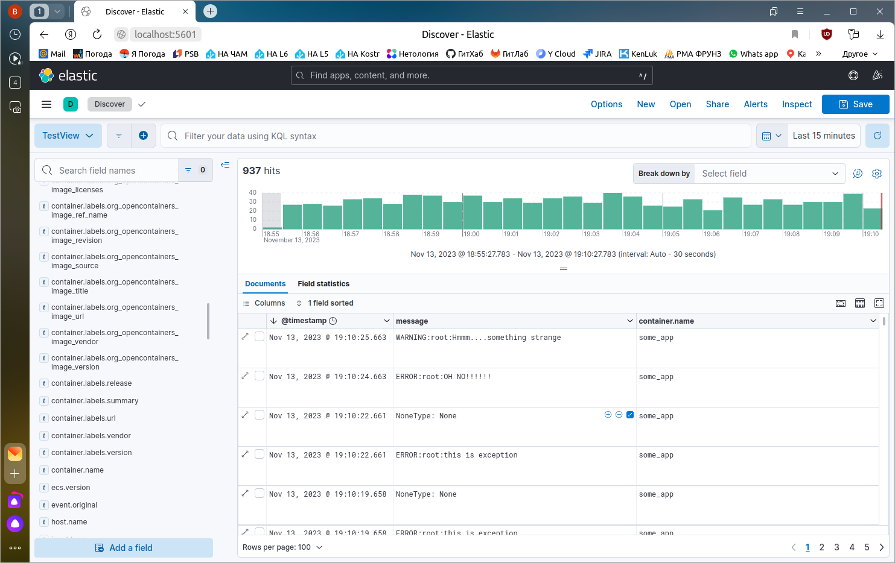

---

### Учебная группа DevOps-32

---

## Решение по домашнему заданию 10-monitoring-04-elk к занятию 15 «Система сбора логов Elastic Stack» 

- [Описание](#description)
- [Cкриншоты](#screenshots)
- [Файлы](#files)
- [Исполнитель](#student)

---

###### Description
### Описание

При выполнении домашнего задания использовались манифест `docker-compose` и конфигурации `filebeat/logstash` из директории [help](https://github.com/netology-code/mnt-homeworks/tree/MNT-video/10-monitoring-04-elk/help) к домашнему заданию.

Домашнее задание выполнялось в `docker` на локальной машине.

---

###### screenshots
### Cкриншоты

    
 Cкриншот `docker ps`...  

    
 Интерфейс Kibana - Index Management...  

    
 Интерфейс Kibana - Index pattern...  

    
 Интерфейс Kibana - Discover (отфильтровано по `message` и `container.name`)...  

---

###### files
### Файлы (использованы из директории `help` в неизменном виде)

[docker-compose манифест](./docker-compose.yml)

[logstash.conf](./configs/logstash.conf)

[logstash.yml](./configs/logstash.yml)

[filebeat.yml](./configs/filebeat.yml)

---

###### Student
### Исполнитель

Сергей Жуков DevOps-32

---