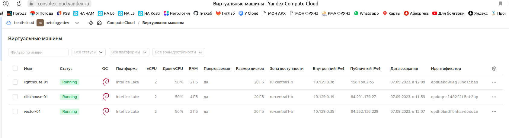
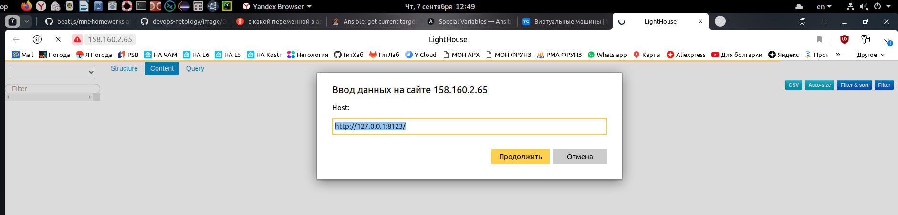

---


### Учебная группа DevOps-32

---

## Решение по домашнему заданию к занятию 3 «Использование Ansible»


- [Описание](#description)
- [Требования к инфраструктуре](#requirements)
- [Переменные и настройки](#vars-and-setup)
- [Запуск](#play)
- [Тестирование](#testing)
- [Исполнитель](#student)

---

###### Description
### Описание

Здесь приводится исходный код `ansible-playbook`, выполняющий установку DB `Clickhouse`, транспортировщика логов `Vector` и `lighthouse` для отображения логов.

Playbook написан для выполнения домашнего задания 3 в рамках обучения работе с `Ansible` и базируется на коде playbook из домашнего задания 2.

---

###### Requirements
### Требования к инфрастуктуре

Для успешного запуска и выполнения настоящего playbook требуется создать в облаке три виртуальных машины с ОС Linux.
1. clickhouse-01 - VM для развертывания clickhouse: 2 CPU, 4 Gb RAM, 20 Gb HDD 
2. vector-01 - VM для развертывания vector: 2 CPU, 2 Gb RAM, 20 Gb HDD
3. lighthouse-01 - VM для развертывания lighthouse: 2 CPU, 2 Gb RAM, 20 Gb HDD

<details>
    <summary> Пример созданных VM  </summary>
  
</details>

---

###### Vars and Setup
### Переменные и настройки

Перед запуском `playbook` требуется его предварительная настройка.
Настройка производится путем создания корректного inventory файла и задания переменных.

Окружение на котором запускается playbook - настраивается в файле `/inventory/prod.yml`

В группе `clickhouse` указывается хост на котором должен быть развернут `clickhouse`,

в группе `vector` - хост(ы) где должен быть развернут `vector`,

В группе `lighthouse` - хост где должен быть развернут `lighthouse`.

IP адреса хостов и имена пользователей берутся из облака в соответствии с созданными VM. 

В соответствующих файлах `vars.yml` указываются версии, названия пакетов и url для скачивания пакаджей.

В файле переменных общем для всех хостов заполняются:

- `db_name:` название базы данных `clickhouse`, где будут храниться данные мониторинга,
- `db_table:` название таблицы в БД `clickhouse`, где будут храниться данные мониторинга,
- `db_user:` имя пользователя для БД
- `db_pass:` пароль пользователя БД

В файле `vars.yml` для `vector` указываются:

- `vector_config_dir:` место хранения конфигурации `vector`, 
- `vector_log_dir:` место расположения файлов `*.log` из которых `vector` считывает данные мониторинга,
  
(открыто пароль хранить здесь неправильно, лучше воспользоваться `ansible-vault`)

Конфигурации `vector`, `lighthouse` и `unit` для запуска `vеctor` в качестве сервиса, создаются на базе шаблонов `jinja2` из каталога `template`. 

---

###### Play
### Запуск

Запуск playbook: `sudo ansible-playbook -i inventory/prod.yml site.yml`

запуск должен производиться из каталога `playbook` содержащего файл `site.yml` 

<details>
    <summary> Вывод ansible...  </summary>

```
beatl@OWEN:~/mnt-homeworks/03/playbook$ ansible-playbook -i inventory/prod.yml site.yml

PLAY [Install Clickhouse] **********************************************************************************************************************************************************************************************************

TASK [Gathering Facts] *************************************************************************************************************************************************************************************************************
ok: [clickhouse-01]

TASK [Clickhouse | Get distrib] ****************************************************************************************************************************************************************************************************
changed: [clickhouse-01] => (item=clickhouse-common-static)
changed: [clickhouse-01] => (item=clickhouse-server)
changed: [clickhouse-01] => (item=clickhouse-client)

TASK [Clickhouse | Install packages] ***********************************************************************************************************************************************************************************************
changed: [clickhouse-01] => (item=clickhouse-common-static)
changed: [clickhouse-01] => (item=clickhouse-server)
changed: [clickhouse-01] => (item=clickhouse-client)

TASK [Clickhouse | Flush handlers] *************************************************************************************************************************************************************************************************

RUNNING HANDLER [Clickhouse | Restart service] *************************************************************************************************************************************************************************************
changed: [clickhouse-01]

TASK [Clickhouse | Create database] ************************************************************************************************************************************************************************************************
changed: [clickhouse-01]

PLAY [Install Vector] **************************************************************************************************************************************************************************************************************

TASK [Gathering Facts] *************************************************************************************************************************************************************************************************************
The authenticity of host '84.252.138.229 (84.252.138.229)' can't be established.
ECDSA key fingerprint is SHA256:5adnzXK4H47tndwY2GODz3qH2O0JbaXGAK3iMBmlXyg.
Are you sure you want to continue connecting (yes/no)? yes
ok: [vector-01]

TASK [Vector | Get distrib] ********************************************************************************************************************************************************************************************************
changed: [vector-01]

TASK [Vector | Install package] ****************************************************************************************************************************************************************************************************
changed: [vector-01]

TASK [Vector | Configure | ensure what config directory exists] ********************************************************************************************************************************************************************
changed: [vector-01]

TASK [Vector | Configure | Template config] ****************************************************************************************************************************************************************************************
changed: [vector-01]

TASK [Vector | Prepare and setup unit from template] *******************************************************************************************************************************************************************************
changed: [vector-01]

TASK [Vector | Flush handlers] *****************************************************************************************************************************************************************************************************

RUNNING HANDLER [Vector | Restart Service] *****************************************************************************************************************************************************************************************
changed: [vector-01]

TASK [Vector | Create Log Dir] *****************************************************************************************************************************************************************************************************
changed: [vector-01]

PLAY [Lighthouse | Install nginx] **************************************************************************************************************************************************************************************************

TASK [Gathering Facts] *************************************************************************************************************************************************************************************************************
The authenticity of host '158.160.2.65 (158.160.2.65)' can't be established.
ECDSA key fingerprint is SHA256:jBhe+n4DMKTWp/fNWtvK65NuSD6S0noPUIkWBT2cjEM.
Are you sure you want to continue connecting (yes/no)? yes
ok: [lighthouse-01]

TASK [Lighthouse | Nginx | Install from apt] ***************************************************************************************************************************************************************************************
changed: [lighthouse-01]

RUNNING HANDLER [Lighthouse | Nginx | Restart Service] *****************************************************************************************************************************************************************************
changed: [lighthouse-01]

PLAY [Install lighthouse] **********************************************************************************************************************************************************************************************************

TASK [Gathering Facts] *************************************************************************************************************************************************************************************************************
ok: [lighthouse-01]

TASK [Lighthouse | Install unzip] **************************************************************************************************************************************************************************************************
ok: [lighthouse-01]

TASK [Lighthouse | Download zip package] *******************************************************************************************************************************************************************************************
changed: [lighthouse-01]

TASK [Lighthouse | Unarch zip package to nginx homedir] ****************************************************************************************************************************************************************************
changed: [lighthouse-01]

TASK [Make nginx config] ***********************************************************************************************************************************************************************************************************
changed: [lighthouse-01]

TASK [Lighthouse | Delete zip package] *********************************************************************************************************************************************************************************************
changed: [lighthouse-01]

RUNNING HANDLER [Lighthouse | Restart Nginx Service] *******************************************************************************************************************************************************************************
changed: [lighthouse-01]

PLAY RECAP *************************************************************************************************************************************************************************************************************************
clickhouse-01              : ok=5    changed=4    unreachable=0    failed=0    skipped=0    rescued=0    ignored=0
lighthouse-01              : ok=10   changed=7    unreachable=0    failed=0    skipped=0    rescued=0    ignored=0
vector-01                  : ok=8    changed=7    unreachable=0    failed=0    skipped=0    rescued=0    ignored=0
```
</details>

---

###### Testing
### Тестирование

1. Подключиться по SSH к VM `clickhouse-01` и убедиться, что `clickhouse-server` запущен.

<details>
    <summary> Пример вывода в консоли VM...  </summary>

```
beatl@clickhouse-01:~$ sudo systemctl status clickhouse-server
● clickhouse-server.service - ClickHouse Server (analytic DBMS for big data)
     Loaded: loaded (/lib/systemd/system/clickhouse-server.service; enabled; vendor preset: enabled)
     Active: active (running) since Thu 2023-09-07 09:22:03 UTC; 6min ago
   Main PID: 1952 (clckhouse-watch)
      Tasks: 208 (limit: 4678)
     Memory: 187.6M
        CPU: 2.914s
     CGroup: /system.slice/clickhouse-server.service
             ├─1952 clickhouse-watchdog        --config=/etc/clickhouse-server/config.xml --pid-file=/run/clickhouse-server/clickhouse-server.pid
             └─1954 /usr/bin/clickhouse-server --config=/etc/clickhouse-server/config.xml --pid-file=/run/clickhouse-server/clickhouse-server.pid

Sep 07 09:22:03 clickhouse-01 systemd[1]: Started ClickHouse Server (analytic DBMS for big data).
Sep 07 09:22:03 clickhouse-01 clickhouse-server[1952]: Processing configuration file '/etc/clickhouse-server/config.xml'.
Sep 07 09:22:03 clickhouse-01 clickhouse-server[1952]: Logging trace to /var/log/clickhouse-server/clickhouse-server.log
Sep 07 09:22:03 clickhouse-01 clickhouse-server[1952]: Logging errors to /var/log/clickhouse-server/clickhouse-server.err.log
Sep 07 09:22:03 clickhouse-01 clickhouse-server[1954]: Processing configuration file '/etc/clickhouse-server/config.xml'.
Sep 07 09:22:03 clickhouse-01 clickhouse-server[1954]: Saved preprocessed configuration to '/var/lib/clickhouse/preprocessed_configs/config.xml'.
Sep 07 09:22:03 clickhouse-01 clickhouse-server[1954]: Processing configuration file '/etc/clickhouse-server/users.xml'.
Sep 07 09:22:03 clickhouse-01 clickhouse-server[1954]: Saved preprocessed configuration to '/var/lib/clickhouse/preprocessed_configs/users.xml'.
```
</details>

2. Запустить в консоли VM `clickhouse-01` `clickhouse-client` и проверить, что соединение с `clickhouse-server` установлено, требуемая база данных создана. 

<details>
    <summary> Пример вывода в консоли VM...  </summary>

```
beatl@clickhouse-01:~$ clickhouse-client
ClickHouse client version 22.8.5.29 (official build).
Connecting to localhost:9000 as user default.
Connected to ClickHouse server version 22.8.5 revision 54460.

Warnings:
 * Linux transparent hugepages are set to "always". Check /sys/kernel/mm/transparent_hugepage/enabled
 * Maximum number of threads is lower than 30000. There could be problems with handling a lot of simultaneous queries.

clickhouse-01.ru-central1.internal :) show databases

SHOW DATABASES

Query id: 9b4dcb4f-abd6-4e86-9bee-21460054ea90

┌─name───────────────┐
│ INFORMATION_SCHEMA │
│ default            │
│ information_schema │
│ logs               │
│ system             │
└────────────────────┘

5 rows in set. Elapsed: 0.001 sec.
```
</details>

3. Подключиться по SSH к VM `vector-01` и убедиться, что `vector.service` запущен.

<details>
    <summary> Пример вывода в консоли VM vector-01...  </summary>

```
beatl@vector-01:~$ sudo systemctl status vector
● vector.service - Vector Service
     Loaded: loaded (/etc/systemd/system/vector.service; static)
     Active: active (running) since Thu 2023-09-07 09:22:25 UTC; 21min ago
   Main PID: 1045 (vector)
      Tasks: 7 (limit: 2340)
     Memory: 47.7M
        CPU: 734ms
     CGroup: /system.slice/vector.service
             └─1045 /usr/bin/vector --config-yaml /home/beatl/mnt-homeworks/03/playbook/vector_config/vector.yml -w

Sep 07 09:22:25 vector-01 vector[1045]: 2023-09-07T09:22:25.774394Z  INFO source{component_kind="source" component_id=my_log_file component_type=file component_name=my_log_file}:file_server: file_source::checkpointer: Attemptin>
Sep 07 09:43:07 vector-01 vector[1045]: 2023-09-07T09:43:07.190209Z  INFO vector::config::watcher: Configuration file changed.
Sep 07 09:43:07 vector-01 vector[1045]: 2023-09-07T09:43:07.190285Z  INFO vector::signal: Signal received. signal="SIGHUP"
Sep 07 09:43:07 vector-01 vector[1045]: 2023-09-07T09:43:07.190836Z  INFO vector::topology::running: Reloading running topology with new configuration.
Sep 07 09:43:10 vector-01 vector[1045]: 2023-09-07T09:43:10.842262Z  INFO vector::topology::running: Running healthchecks.
Sep 07 09:43:10 vector-01 vector[1045]: 2023-09-07T09:43:10.842332Z  INFO vector::topology::running: New configuration loaded successfully.
Sep 07 09:43:10 vector-01 vector[1045]: 2023-09-07T09:43:10.842338Z  INFO vector: Vector has reloaded. path=[File("/home/beatl/mnt-homeworks/03/playbook/vector_config/vector.yml", Some(Yaml))]
```
</details>

4. Из браузера по IP адресу подключться к VM `lighthouse` и убедиться, что открылась стартовая страница `lighhouse` .

<details>
    <summary> Пример открытой страницы...  </summary>
  
</details>

---

###### Student
### Исполнитель

Сергей Жуков DevOps-32

---


