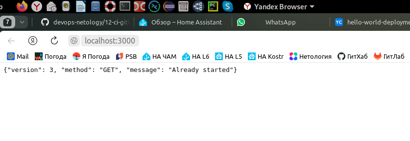

---


### Учебная группа DevOps-32

---

## Решение по домашнему заданию 09-ci-06-gitlab к занятию 12 "Gitlab" 


- [Описание](#description)
- [Часть 1](#part1)
- [Часть 2](#part2)
- [Файлы и скриншоты к части 2](#files)
- [Исполнитель](#student)

---

###### Description
### Описание

В соответствии с заданием решение состоит из двух частей

В [первой части](#part1) приведено решение по пп. 1-2, во [второй части](#part2) решение по п.3*

---

###### part1
### Часть 1

Проект на сервере GitLab: [GitLab project](https://gitlab.com/beatljs/myfirstcicdprj)

Файл gitlab-ci.yml: [gitlab-ci.yml](https://gitlab.com/beatljs/myfirstcicdprj/-/blob/main/.gitlab-ci.yml?ref_type=heads)

Dockerfile: [Dockerfile](https://gitlab.com/beatljs/myfirstcicdprj/-/blob/main/Dockerfile)

Лог успешного выполнения пайплайна stage `build`: [build_log](https://gitlab.com/beatljs/myfirstcicdprj/-/jobs/5269952439)

Лог успешного выполнения пайплайна stage `deploy`: [deoloy_log](https://gitlab.com/beatljs/myfirstcicdprj/-/jobs/5270005969)

Решенный Issue: [solved Issue](https://gitlab.com/beatljs/myfirstcicdprj/-/issues/1)

Docker Image в реестре GitLab: [docker image](https://gitlab.com/beatljs/myfirstcicdprj/container_registry/5667011)

---

###### part2
### Часть 2

В каталоге [src](./src) содержится сценарий `Terraform`, создающий инфраструктуру в облаке `ya-cloud` для выполнения п.3 домашнего задания 12 «GiLab».
Сценарий создает сервисный аккаунт, облачную сеть, `Сontainer Registry`, кластер `Kubernetes`, а также группы безопасности и правила для доступа к кластеру

<details>
    <summary> Вывод `terraform apply` ...  </summary>

```
beatl@OWEN:~/mnt-homeworks/src$ terraform apply

Terraform used the selected providers to generate the following execution plan. Resource actions are indicated with the following symbols:
  + create

Terraform will perform the following actions:

  # yandex_container_registry.default will be created
  + resource "yandex_container_registry" "default" {
      + created_at = (known after apply)
      + folder_id  = (sensitive value)
      + id         = (known after apply)
      + labels     = {
          + "my-label" = "my-label-value"
        }
      + name       = "regforgitlab"
      + status     = (known after apply)
    }

  # yandex_iam_service_account.k8s-sa will be created
  + resource "yandex_iam_service_account" "k8s-sa" {
      + created_at  = (known after apply)
      + description = "Service account for the Managed Service for Kubernetes cluster and node group"
      + folder_id   = (known after apply)
      + id          = (known after apply)
      + name        = "saforgitlab"
    }

  # yandex_kubernetes_cluster.k8s-cluster will be created
  + resource "yandex_kubernetes_cluster" "k8s-cluster" {
      + cluster_ipv4_range       = (known after apply)
      + cluster_ipv6_range       = (known after apply)
      + created_at               = (known after apply)
      + description              = "Managed Service for Kubernetes cluster"
      + folder_id                = (known after apply)
      + health                   = (known after apply)
      + id                       = (known after apply)
      + labels                   = (known after apply)
      + log_group_id             = (known after apply)
      + name                     = "k8s-cluster"
      + network_id               = (known after apply)
      + node_ipv4_cidr_mask_size = 24
      + node_service_account_id  = (known after apply)
      + release_channel          = (known after apply)
      + service_account_id       = (known after apply)
      + service_ipv4_range       = (known after apply)
      + service_ipv6_range       = (known after apply)
      + status                   = (known after apply)

      + master {
          + cluster_ca_certificate = (known after apply)
          + external_v4_address    = (known after apply)
          + external_v4_endpoint   = (known after apply)
          + external_v6_endpoint   = (known after apply)
          + internal_v4_address    = (known after apply)
          + internal_v4_endpoint   = (known after apply)
          + public_ip              = true
          + security_group_ids     = (known after apply)
          + version                = "1.27"
          + version_info           = (known after apply)

          + zonal {
              + subnet_id = (known after apply)
              + zone      = "ru-central1-a"
            }
        }
    }

  # yandex_kubernetes_node_group.k8s-node-group will be created
  + resource "yandex_kubernetes_node_group" "k8s-node-group" {
      + cluster_id        = (known after apply)
      + created_at        = (known after apply)
      + description       = "Node group for the Managed Service for Kubernetes cluster"
      + id                = (known after apply)
      + instance_group_id = (known after apply)
      + labels            = (known after apply)
      + name              = "k8s-node-group"
      + status            = (known after apply)
      + version           = "1.27"
      + version_info      = (known after apply)

      + allocation_policy {
          + location {
              + subnet_id = (known after apply)
              + zone      = "ru-central1-a"
            }
        }

      + instance_template {
          + metadata                  = (known after apply)
          + nat                       = (known after apply)
          + network_acceleration_type = (known after apply)
          + platform_id               = "standard-v2"

          + boot_disk {
              + size = 64
              + type = "network-hdd"
            }

          + network_interface {
              + ipv4               = true
              + ipv6               = (known after apply)
              + nat                = true
              + security_group_ids = (known after apply)
              + subnet_ids         = (known after apply)
            }

          + resources {
              + core_fraction = (known after apply)
              + cores         = 4
              + gpus          = 0
              + memory        = 8
            }
        }

      + scale_policy {
          + auto_scale {
              + initial = 1
              + max     = 4
              + min     = 1
            }
        }
    }

  # yandex_resourcemanager_folder_iam_binding.editor will be created
  + resource "yandex_resourcemanager_folder_iam_binding" "editor" {
      + folder_id = (sensitive value)
      + id        = (known after apply)
      + members   = (known after apply)
      + role      = "editor"
    }

  # yandex_resourcemanager_folder_iam_binding.images-puller will be created
  + resource "yandex_resourcemanager_folder_iam_binding" "images-puller" {
      + folder_id = (sensitive value)
      + id        = (known after apply)
      + members   = (known after apply)
      + role      = "container-registry.images.puller"
    }

  # yandex_resourcemanager_folder_iam_binding.images-pusher will be created
  + resource "yandex_resourcemanager_folder_iam_binding" "images-pusher" {
      + folder_id = (sensitive value)
      + id        = (known after apply)
      + members   = (known after apply)
      + role      = "container-registry.images.pusher"
    }

  # yandex_vpc_network.k8s-network will be created
  + resource "yandex_vpc_network" "k8s-network" {
      + created_at                = (known after apply)
      + default_security_group_id = (known after apply)
      + description               = "Network for the Managed Service for Kubernetes cluster"
      + folder_id                 = (known after apply)
      + id                        = (known after apply)
      + labels                    = (known after apply)
      + name                      = "k8s-network"
      + subnet_ids                = (known after apply)
    }

  # yandex_vpc_security_group.k8s-main-sg will be created
  + resource "yandex_vpc_security_group" "k8s-main-sg" {
      + created_at  = (known after apply)
      + description = "Security group for the Managed Service for Kubernetes cluster"
      + folder_id   = (known after apply)
      + id          = (known after apply)
      + labels      = (known after apply)
      + name        = "k8s-main-sg"
      + network_id  = (known after apply)
      + status      = (known after apply)
    }

  # yandex_vpc_security_group_rule.HTTP will be created
  + resource "yandex_vpc_security_group_rule" "HTTP" {
      + description            = "The rule allows HTTP traffic"
      + direction              = "ingress"
      + from_port              = -1
      + id                     = (known after apply)
      + labels                 = (known after apply)
      + port                   = 80
      + protocol               = "TCP"
      + security_group_binding = (known after apply)
      + to_port                = -1
      + v4_cidr_blocks         = [
          + "0.0.0.0/0",
        ]
    }

  # yandex_vpc_security_group_rule.ICMP-debug will be created
  + resource "yandex_vpc_security_group_rule" "ICMP-debug" {
      + description            = "The rule allows receipt of debugging ICMP packets from internal subnets"
      + direction              = "ingress"
      + from_port              = -1
      + id                     = (known after apply)
      + labels                 = (known after apply)
      + port                   = -1
      + protocol               = "ICMP"
      + security_group_binding = (known after apply)
      + to_port                = -1
      + v4_cidr_blocks         = [
          + "10.1.0.0/16",
        ]
    }

  # yandex_vpc_security_group_rule.SSH will be created
  + resource "yandex_vpc_security_group_rule" "SSH" {
      + description            = "The rule allows connection to Git repository by SSH on 22 port from the Internet"
      + direction              = "ingress"
      + from_port              = -1
      + id                     = (known after apply)
      + labels                 = (known after apply)
      + port                   = 22
      + protocol               = "TCP"
      + security_group_binding = (known after apply)
      + to_port                = -1
      + v4_cidr_blocks         = [
          + "0.0.0.0/0",
        ]
    }

  # yandex_vpc_security_group_rule.loadbalancer will be created
  + resource "yandex_vpc_security_group_rule" "loadbalancer" {
      + description            = "The rule allows availability checks from the load balancer's range of addresses"
      + direction              = "ingress"
      + from_port              = 0
      + id                     = (known after apply)
      + labels                 = (known after apply)
      + port                   = -1
      + predefined_target      = "loadbalancer_healthchecks"
      + protocol               = "TCP"
      + security_group_binding = (known after apply)
      + to_port                = 65535
    }

  # yandex_vpc_security_group_rule.node-interaction will be created
  + resource "yandex_vpc_security_group_rule" "node-interaction" {
      + description            = "The rule allows the master-node and node-node interaction within the security group"
      + direction              = "ingress"
      + from_port              = 0
      + id                     = (known after apply)
      + labels                 = (known after apply)
      + port                   = -1
      + predefined_target      = "self_security_group"
      + protocol               = "ANY"
      + security_group_binding = (known after apply)
      + to_port                = 65535
    }

  # yandex_vpc_security_group_rule.outgoing-traffic will be created
  + resource "yandex_vpc_security_group_rule" "outgoing-traffic" {
      + description            = "The rule allows all outgoing traffic"
      + direction              = "egress"
      + from_port              = 0
      + id                     = (known after apply)
      + labels                 = (known after apply)
      + port                   = -1
      + protocol               = "ANY"
      + security_group_binding = (known after apply)
      + to_port                = 65535
      + v4_cidr_blocks         = [
          + "0.0.0.0/0",
        ]
    }

  # yandex_vpc_security_group_rule.pod-service-interaction will be created
  + resource "yandex_vpc_security_group_rule" "pod-service-interaction" {
      + description            = "The rule allows the pod-pod and service-service interaction"
      + direction              = "ingress"
      + from_port              = 0
      + id                     = (known after apply)
      + labels                 = (known after apply)
      + port                   = -1
      + protocol               = "ANY"
      + security_group_binding = (known after apply)
      + to_port                = 65535
      + v4_cidr_blocks         = [
          + "10.1.0.0/16",
        ]
    }

  # yandex_vpc_security_group_rule.port-443 will be created
  + resource "yandex_vpc_security_group_rule" "port-443" {
      + description            = "The rule allows connection to Kubernetes API on 443 port from the Internet"
      + direction              = "ingress"
      + from_port              = -1
      + id                     = (known after apply)
      + labels                 = (known after apply)
      + port                   = 443
      + protocol               = "TCP"
      + security_group_binding = (known after apply)
      + to_port                = -1
      + v4_cidr_blocks         = [
          + "0.0.0.0/0",
        ]
    }

  # yandex_vpc_security_group_rule.port-5050 will be created
  + resource "yandex_vpc_security_group_rule" "port-5050" {
      + description            = "The rule allows connection to Yandex Container Registry on 5050 port"
      + direction              = "ingress"
      + from_port              = -1
      + id                     = (known after apply)
      + labels                 = (known after apply)
      + port                   = 5050
      + protocol               = "TCP"
      + security_group_binding = (known after apply)
      + to_port                = -1
      + v4_cidr_blocks         = [
          + "0.0.0.0/0",
        ]
    }

  # yandex_vpc_security_group_rule.port-6443 will be created
  + resource "yandex_vpc_security_group_rule" "port-6443" {
      + description            = "The rule allows connection to Kubernetes API on 6443 port from the Internet"
      + direction              = "ingress"
      + from_port              = -1
      + id                     = (known after apply)
      + labels                 = (known after apply)
      + port                   = 6443
      + protocol               = "TCP"
      + security_group_binding = (known after apply)
      + to_port                = -1
      + v4_cidr_blocks         = [
          + "0.0.0.0/0",
        ]
    }

  # yandex_vpc_subnet.subnet-a will be created
  + resource "yandex_vpc_subnet" "subnet-a" {
      + created_at     = (known after apply)
      + description    = "Subnet in ru-central1-a availability zone"
      + folder_id      = (known after apply)
      + id             = (known after apply)
      + labels         = (known after apply)
      + name           = "subnet-a"
      + network_id     = (known after apply)
      + v4_cidr_blocks = [
          + "10.1.0.0/16",
        ]
      + v6_cidr_blocks = (known after apply)
      + zone           = "ru-central1-a"
    }

Plan: 20 to add, 0 to change, 0 to destroy.

Do you want to perform these actions?
  Terraform will perform the actions described above.
  Only 'yes' will be accepted to approve.

  Enter a value: yes

yandex_container_registry.default: Creating...
yandex_vpc_network.k8s-network: Creating...
yandex_iam_service_account.k8s-sa: Creating...
yandex_container_registry.default: Creation complete after 2s [id=crpbpgkfef509lccqpn8]
yandex_iam_service_account.k8s-sa: Creation complete after 2s [id=ajefo3lubck3hd4j7es6]
yandex_resourcemanager_folder_iam_binding.editor: Creating...
yandex_resourcemanager_folder_iam_binding.images-puller: Creating...
yandex_resourcemanager_folder_iam_binding.images-pusher: Creating...
yandex_vpc_network.k8s-network: Creation complete after 3s [id=enp3jub3fdo4il4300pm]
yandex_vpc_subnet.subnet-a: Creating...
yandex_vpc_security_group.k8s-main-sg: Creating...
yandex_vpc_subnet.subnet-a: Creation complete after 1s [id=e9bk0htli4fu12t781rh]
yandex_vpc_security_group.k8s-main-sg: Creation complete after 3s [id=enplblauf3k91pttjqhn]
yandex_vpc_security_group_rule.ICMP-debug: Creating...
yandex_vpc_security_group_rule.HTTP: Creating...
yandex_vpc_security_group_rule.port-443: Creating...
yandex_vpc_security_group_rule.loadbalancer: Creating...
yandex_vpc_security_group_rule.outgoing-traffic: Creating...
yandex_vpc_security_group_rule.port-5050: Creating...
yandex_vpc_security_group_rule.pod-service-interaction: Creating...
yandex_resourcemanager_folder_iam_binding.editor: Creation complete after 4s [id=b1ggopu0i05k9eac2102/editor]
yandex_vpc_security_group_rule.SSH: Creating...
yandex_vpc_security_group_rule.ICMP-debug: Creation complete after 0s [id=enp9tu6ujejqjjj6mc2m]
yandex_vpc_security_group_rule.node-interaction: Creating...
yandex_vpc_security_group_rule.loadbalancer: Creation complete after 1s [id=enp2cq7vg6g690j75l6p]
yandex_vpc_security_group_rule.port-6443: Creating...
yandex_vpc_security_group_rule.HTTP: Creation complete after 1s [id=enp60sj1emt5i000totj]
yandex_vpc_security_group_rule.outgoing-traffic: Creation complete after 2s [id=enpk3b9h2d0g1d1ioo2c]
yandex_vpc_security_group_rule.port-443: Creation complete after 2s [id=enpa644ooruob6lm1dul]
yandex_vpc_security_group_rule.port-5050: Creation complete after 3s [id=enpcosvjlfkmjuoj9ple]
yandex_vpc_security_group_rule.pod-service-interaction: Creation complete after 3s [id=enp54ka3b37ll60t5dls]
yandex_vpc_security_group_rule.SSH: Creation complete after 4s [id=enpub04o0vlpkbpbkcn4]
yandex_vpc_security_group_rule.node-interaction: Creation complete after 4s [id=enpigm2kkdfuafu3kdtl]
yandex_vpc_security_group_rule.port-6443: Creation complete after 4s [id=enpv7r8idncigt9tklm3]
yandex_resourcemanager_folder_iam_binding.images-pusher: Creation complete after 9s [id=b1ggopu0i05k9eac2102/container-registry.images.pusher]
yandex_resourcemanager_folder_iam_binding.images-puller: Still creating... [10s elapsed]
yandex_resourcemanager_folder_iam_binding.images-puller: Creation complete after 13s [id=b1ggopu0i05k9eac2102/container-registry.images.puller]
yandex_kubernetes_cluster.k8s-cluster: Creating...
yandex_kubernetes_cluster.k8s-cluster: Still creating... [10s elapsed]
    - skip -
yandex_kubernetes_cluster.k8s-cluster: Still creating... [9m50s elapsed]
yandex_kubernetes_cluster.k8s-cluster: Creation complete after 9m55s [id=catg64k0a0f06scgvh7p]
yandex_kubernetes_node_group.k8s-node-group: Creating...
yandex_kubernetes_node_group.k8s-node-group: Still creating... [10s elapsed]
    - skip -
yandex_kubernetes_node_group.k8s-node-group: Still creating... [1m30s elapsed]
yandex_kubernetes_node_group.k8s-node-group: Creation complete after 1m33s [id=catvpr4qp81o5om9udcr]

Apply complete! Resources: 20 added, 0 changed, 0 destroyed.

```
</details>

Инстанс `Managed Service For Gitlab` создавался и настраивался вручную из консоли

<details>
    <summary> Скриншот созданных ресурсов ...  </summary>


</details>

После настройки инстанса в нем был создан проект `YaCiCdProject` и заполнен необходимыми файлами

<details>
    <summary> Скриншот созданного проекта ...  </summary>


</details>

Далее после исправления всех ошибок и настроек, после первого успешного выполнения пайплайна (успешный `bild` и `deploy`) на ветке `main`, в кластере поднялся pod c контейнером.

<details>
    <summary> Скриншот работающего pod ...  </summary>


</details>

<details>
    <summary> Подключаем localhost к pod ...  </summary>

```
beatl@OWEN:~$ kubectl port-forward pod/hello-world-deployment-d64f76dc5-rzsl6 3000:5290 --namespace hello-world
Forwarding from 127.0.0.1:3000 -> 5290
Forwarding from [::1]:3000 -> 5290
Handling connection for 3000
```
</details>

<details>
    <summary>  Наблюдаем результат...  </summary>



</details>

В соответствии с заданием создаем `Issue` на доработку и `merge request`

В репозитории создается новая ветка.

Вносим изменения в файл `python-api.yml`. После коммита в новую ветку автоматически запускается пайплайн `stage build`.

<details>
    <summary>  Выполненый build...  </summary>


</details>


<details>
    <summary>  Лог успешного выполнения build...  </summary>

```
Running with gitlab-runner 16.1.0 (b72e108d)
  on beatl-gitlab-runner-gitlab-runner-5d55597487-z9fg9 oKb3y8Fy, system ID: r_La8Kh7oXw8KF
Preparing the "kubernetes" executor
00:00
Using Kubernetes namespace: beatl-namespace
Using Kubernetes executor with image gcr.io/kaniko-project/executor:debug ...
Using attach strategy to execute scripts...
Preparing environment
00:07
Waiting for pod beatl-namespace/runner-okb3y8fy-project-1-concurrent-0jj95s to be running, status is Pending
Waiting for pod beatl-namespace/runner-okb3y8fy-project-1-concurrent-0jj95s to be running, status is Pending
	ContainersNotReady: "containers with unready status: [build helper]"
	ContainersNotReady: "containers with unready status: [build helper]"
Running on runner-okb3y8fy-project-1-concurrent-0jj95s via beatl-gitlab-runner-gitlab-runner-5d55597487-z9fg9...
Getting source from Git repository
00:01
Fetching changes with git depth set to 20...
Initialized empty Git repository in /builds/beatl/yacicdproject/.git/
Created fresh repository.
Checking out cb2c41d5 as detached HEAD (ref is 2)...
Skipping Git submodules setup
Executing "step_script" stage of the job script
00:40
$ mkdir -p /kaniko/.docker
$ echo "{\"auths\":{\"$CI_REGISTRY\":{\"auth\":\"$(echo -n "json_key:${CI_REGISTRY_KEY}" | base64 | tr -d '\n' )\"}}}" > /kaniko/.docker/config.json
$ /kaniko/executor \ # collapsed multi-line command
INFO[0000] Retrieving image manifest centos:7           
INFO[0000] Retrieving image centos:7 from registry index.docker.io 
INFO[0001] Built cross stage deps: map[]                
INFO[0001] Retrieving image manifest centos:7           
INFO[0001] Returning cached image manifest              
INFO[0001] Executing 0 build triggers                   
INFO[0001] Building stage 'centos:7' [idx: '0', base-idx: '-1'] 
INFO[0001] Unpacking rootfs as cmd RUN yum install python3 python3-pip -y requires it. 
INFO[0005] RUN yum install python3 python3-pip -y       
INFO[0005] Initializing snapshotter ...                 
INFO[0005] Taking snapshot of full filesystem...        
INFO[0008] Cmd: /bin/sh                                 
INFO[0008] Args: [-c yum install python3 python3-pip -y] 
INFO[0008] Running: [/bin/sh -c yum install python3 python3-pip -y] 
Loaded plugins: fastestmirror, ovl
Determining fastest mirrors
 * base: mirror.hyperdedic.ru
 * extras: mirrors.datahouse.ru
 * updates: mirrors.datahouse.ru
Resolving Dependencies
--> Running transaction check
---> Package python3.x86_64 0:3.6.8-19.el7_9 will be installed
--> Processing Dependency: python3-libs(x86-64) = 3.6.8-19.el7_9 for package: python3-3.6.8-19.el7_9.x86_64
--> Processing Dependency: python3-setuptools for package: python3-3.6.8-19.el7_9.x86_64
--> Processing Dependency: libpython3.6m.so.1.0()(64bit) for package: python3-3.6.8-19.el7_9.x86_64
---> Package python3-pip.noarch 0:9.0.3-8.el7 will be installed
--> Running transaction check
---> Package python3-libs.x86_64 0:3.6.8-19.el7_9 will be installed
--> Processing Dependency: libtirpc.so.1()(64bit) for package: python3-libs-3.6.8-19.el7_9.x86_64
---> Package python3-setuptools.noarch 0:39.2.0-10.el7 will be installed
--> Running transaction check
---> Package libtirpc.x86_64 0:0.2.4-0.16.el7 will be installed
--> Finished Dependency Resolution
Dependencies Resolved
================================================================================
 Package                  Arch         Version              Repository     Size
================================================================================
Installing:
 python3                  x86_64       3.6.8-19.el7_9       updates        70 k
 python3-pip              noarch       9.0.3-8.el7          base          1.6 M
Installing for dependencies:
 libtirpc                 x86_64       0.2.4-0.16.el7       base           89 k
 python3-libs             x86_64       3.6.8-19.el7_9       updates       6.9 M
 python3-setuptools       noarch       39.2.0-10.el7        base          629 k
Transaction Summary
================================================================================
Install  2 Packages (+3 Dependent packages)
Total download size: 9.3 M
Installed size: 48 M
Downloading packages:
warning: /var/cache/yum/x86_64/7/base/packages/libtirpc-0.2.4-0.16.el7.x86_64.rpm: Header V3 RSA/SHA256 Signature, key ID f4a80eb5: NOKEY
Public key for libtirpc-0.2.4-0.16.el7.x86_64.rpm is not installed
Public key for python3-3.6.8-19.el7_9.x86_64.rpm is not installed
--------------------------------------------------------------------------------
Total                                               40 MB/s | 9.3 MB  00:00     
Retrieving key from file:///etc/pki/rpm-gpg/RPM-GPG-KEY-CentOS-7
Importing GPG key 0xF4A80EB5:
 Userid     : "CentOS-7 Key (CentOS 7 Official Signing Key) <security@centos.org>"
 Fingerprint: 6341 ab27 53d7 8a78 a7c2 7bb1 24c6 a8a7 f4a8 0eb5
 Package    : centos-release-7-9.2009.0.el7.centos.x86_64 (@CentOS)
 From       : /etc/pki/rpm-gpg/RPM-GPG-KEY-CentOS-7
Running transaction check
Running transaction test
Transaction test succeeded
Running transaction
  Installing : libtirpc-0.2.4-0.16.el7.x86_64                               1/5
 
  Installing : python3-setuptools-39.2.0-10.el7.noarch                      2/5 
  Installing : python3-pip-9.0.3-8.el7.noarch                               3/5
 
  Installing : python3-3.6.8-19.el7_9.x86_64                                4/5
 
  Installing : python3-libs-3.6.8-19.el7_9.x86_64                           5/5 
  Verifying  : libtirpc-0.2.4-0.16.el7.x86_64                               1/5 
  Verifying  : python3-libs-3.6.8-19.el7_9.x86_64                           2/5 
  Verifying  : python3-3.6.8-19.el7_9.x86_64                                3/5 
  Verifying  : python3-setuptools-39.2.0-10.el7.noarch                      4/5 
  Verifying  : python3-pip-9.0.3-8.el7.noarch                               5/5 
Installed:
  python3.x86_64 0:3.6.8-19.el7_9        python3-pip.noarch 0:9.0.3-8.el7       
Dependency Installed:
  libtirpc.x86_64 0:0.2.4-0.16.el7                                              
  python3-libs.x86_64 0:3.6.8-19.el7_9                                          
  python3-setuptools.noarch 0:39.2.0-10.el7                                     
Complete!
INFO[0017] Taking snapshot of full filesystem...        
INFO[0024] COPY requirements.txt requirements.txt       
INFO[0024] Taking snapshot of files...                  
INFO[0024] RUN pip3 install -r requirements.txt         
INFO[0024] Cmd: /bin/sh                                 
INFO[0024] Args: [-c pip3 install -r requirements.txt]  
INFO[0024] Running: [/bin/sh -c pip3 install -r requirements.txt] 
WARNING: Running pip install with root privileges is generally not a good idea. Try `pip3 install --user` instead.
Collecting flask (from -r requirements.txt (line 1))
  Downloading https://files.pythonhosted.org/packages/cd/77/59df23681f4fd19b7cbbb5e92484d46ad587554f5d490f33ef907e456132/Flask-2.0.3-py3-none-any.whl (95kB)
Collecting flask_restful (from -r requirements.txt (line 2))
  Downloading https://files.pythonhosted.org/packages/d7/7b/f0b45f0df7d2978e5ae51804bb5939b7897b2ace24306009da0cc34d8d1f/Flask_RESTful-0.3.10-py2.py3-none-any.whl
Collecting flask_jsonpify (from -r requirements.txt (line 3))
  Downloading https://files.pythonhosted.org/packages/60/0f/c389dea3988bffbe32c1a667989914b1cc0bce31b338c8da844d5e42b503/Flask-Jsonpify-1.5.0.tar.gz
Collecting Jinja2>=3.0 (from flask->-r requirements.txt (line 1))
  Downloading https://files.pythonhosted.org/packages/20/9a/e5d9ec41927401e41aea8af6d16e78b5e612bca4699d417f646a9610a076/Jinja2-3.0.3-py3-none-any.whl (133kB)
Collecting click>=7.1.2 (from flask->-r requirements.txt (line 1))
  Downloading https://files.pythonhosted.org/packages/4a/a8/0b2ced25639fb20cc1c9784de90a8c25f9504a7f18cd8b5397bd61696d7d/click-8.0.4-py3-none-any.whl (97kB)
Collecting Werkzeug>=2.0 (from flask->-r requirements.txt (line 1))
  Downloading https://files.pythonhosted.org/packages/f4/f3/22afbdb20cc4654b10c98043414a14057cd27fdba9d4ae61cea596000ba2/Werkzeug-2.0.3-py3-none-any.whl (289kB)
Collecting itsdangerous>=2.0 (from flask->-r requirements.txt (line 1))
  Downloading https://files.pythonhosted.org/packages/9c/96/26f935afba9cd6140216da5add223a0c465b99d0f112b68a4ca426441019/itsdangerous-2.0.1-py3-none-any.whl
Collecting six>=1.3.0 (from flask_restful->-r requirements.txt (line 2))
  Downloading https://files.pythonhosted.org/packages/d9/5a/e7c31adbe875f2abbb91bd84cf2dc52d792b5a01506781dbcf25c91daf11/six-1.16.0-py2.py3-none-any.whl
Collecting aniso8601>=0.82 (from flask_restful->-r requirements.txt (line 2))
  Downloading https://files.pythonhosted.org/packages/e3/04/e97c12dc034791d7b504860acfcdd2963fa21ae61eaca1c9d31245f812c3/aniso8601-9.0.1-py2.py3-none-any.whl (52kB)
Collecting pytz (from flask_restful->-r requirements.txt (line 2))
  Downloading https://files.pythonhosted.org/packages/32/4d/aaf7eff5deb402fd9a24a1449a8119f00d74ae9c2efa79f8ef9994261fc2/pytz-2023.3.post1-py2.py3-none-any.whl (502kB)
Collecting MarkupSafe>=2.0 (from Jinja2>=3.0->flask->-r requirements.txt (line 1))
  Downloading https://files.pythonhosted.org/packages/fc/d6/57f9a97e56447a1e340f8574836d3b636e2c14de304943836bd645fa9c7e/MarkupSafe-2.0.1-cp36-cp36m-manylinux1_x86_64.whl
Collecting importlib-metadata; python_version < "3.8" (from click>=7.1.2->flask->-r requirements.txt (line 1))
  Downloading https://files.pythonhosted.org/packages/a0/a1/b153a0a4caf7a7e3f15c2cd56c7702e2cf3d89b1b359d1f1c5e59d68f4ce/importlib_metadata-4.8.3-py3-none-any.whl
Collecting dataclasses; python_version < "3.7" (from Werkzeug>=2.0->flask->-r requirements.txt (line 1))
  Downloading https://files.pythonhosted.org/packages/fe/ca/75fac5856ab5cfa51bbbcefa250182e50441074fdc3f803f6e76451fab43/dataclasses-0.8-py3-none-any.whl
Collecting typing-extensions>=3.6.4; python_version < "3.8" (from importlib-metadata; python_version < "3.8"->click>=7.1.2->flask->-r requirements.txt (line 1))
  Downloading https://files.pythonhosted.org/packages/45/6b/44f7f8f1e110027cf88956b59f2fad776cca7e1704396d043f89effd3a0e/typing_extensions-4.1.1-py3-none-any.whl
Collecting zipp>=0.5 (from importlib-metadata; python_version < "3.8"->click>=7.1.2->flask->-r requirements.txt (line 1))
  Downloading https://files.pythonhosted.org/packages/bd/df/d4a4974a3e3957fd1c1fa3082366d7fff6e428ddb55f074bf64876f8e8ad/zipp-3.6.0-py3-none-any.whl
Installing collected packages: MarkupSafe, Jinja2, typing-extensions, zipp, importlib-metadata, click, dataclasses, Werkzeug, itsdangerous, flask, six, aniso8601, pytz, flask-restful, flask-jsonpify
  Running setup.py install for flask-jsonpify: started
    Running setup.py install for flask-jsonpify: finished with status 'done'
Successfully installed Jinja2-3.0.3 MarkupSafe-2.0.1 Werkzeug-2.0.3 aniso8601-9.0.1 click-8.0.4 dataclasses-0.8 flask-2.0.3 flask-jsonpify-1.5.0 flask-restful-0.3.10 importlib-metadata-4.8.3 itsdangerous-2.0.1 pytz-2023.3.post1 six-1.16.0 typing-extensions-4.1.1 zipp-3.6.0
INFO[0032] Taking snapshot of full filesystem...        
INFO[0035] WORKDIR /python_api                          
INFO[0035] Cmd: workdir                                 
INFO[0035] Changed working directory to /python_api     
INFO[0035] Creating directory /python_api with uid -1 and gid -1 
INFO[0035] Taking snapshot of files...                  
INFO[0035] COPY python-api.py python-api.py             
INFO[0035] Taking snapshot of files...                  
INFO[0035] CMD ["python3", "python-api.py"]             
INFO[0035] Pushing image to cr.yandex/crpbpgkfef509lccqpn8/hello:gitlab-cb2c41d5 
INFO[0040] Pushed cr.yandex/crpbpgkfef509lccqpn8/hello@sha256:6cd7783a50577dc050c3a11e708f687ad973aac2e55c32753cd34d14df5ad646 
Cleaning up project directory and file based variables
00:01
Job succeeded
```
</details>

Созданный в результате `docker image` появляется в реестре `Container Registry`

<details>
    <summary>  Скриншот реестра...  </summary>


</details>

Далее в `merge request` выполняется слияние на ветку `main` и запускется `pipeline` `build` и `deploy`

<details>
    <summary>  Успешно выполненные `build` и `deploy` ...  </summary>


</details>

<details>
    <summary>  Лог успешного `deploy`...  </summary>

```
Running with gitlab-runner 16.1.0 (b72e108d)
  on beatl-gitlab-runner-gitlab-runner-5d55597487-z9fg9 oKb3y8Fy, system ID: r_La8Kh7oXw8KF
Preparing the "kubernetes" executor
00:00
Using Kubernetes namespace: beatl-namespace
Using Kubernetes executor with image bitnami/kubectl:latest ...
Using attach strategy to execute scripts...
Preparing environment
00:07
Waiting for pod beatl-namespace/runner-okb3y8fy-project-1-concurrent-0qf4mc to be running, status is Pending
Waiting for pod beatl-namespace/runner-okb3y8fy-project-1-concurrent-0qf4mc to be running, status is Pending
	ContainersNotReady: "containers with unready status: [build helper]"
	ContainersNotReady: "containers with unready status: [build helper]"
Running on runner-okb3y8fy-project-1-concurrent-0qf4mc via beatl-gitlab-runner-gitlab-runner-5d55597487-z9fg9...
Getting source from Git repository
00:00
Fetching changes with git depth set to 20...
Initialized empty Git repository in /builds/beatl/yacicdproject/.git/
Created fresh repository.
Checking out 62765c1e as detached HEAD (ref is main)...
Skipping Git submodules setup
Executing "step_script" stage of the job script
00:02
$ kubectl config get-contexts
CURRENT   NAME                             CLUSTER   AUTHINFO   NAMESPACE
          beatl/yacicdproject:mykubagent   gitlab    agent:2    
$ kubectl config use-context ${CI_PROJECT_PATH}:mykubagent
Switched to context "beatl/yacicdproject:mykubagent".
$ cat k8s.yaml | sed -e "s,__IMAGE__,${CI_REGISTRY}/hello:gitlab-${CI_COMMIT_SHORT_SHA}," | kubectl -n hello-world apply -f -
namespace/hello-world unchanged
deployment.apps/hello-world-deployment configured
Cleaning up project directory and file based variables
00:00
Job succeeded
```
</details>

Снова подключаемся к `pod`:

<details>
    <summary>  Требуемый результат достинут!  </summary>


</details>

Закрываем Issue...

Удаляем ресурсы в `ya-cloud`

---

###### files
### Файлы и скриншоты к части 2

Файл gitlab-ci.yml: [gitlab-ci.yml](./kube/gitlab-ci.yml)

Dockerfile: [Dockerfile](./kube/Dockerfile)

Manifest: [k8s.yaml](./kube/k8s.yaml)

<details>
    <summary> Успешно выполненный `Issue` </summary>


</details>

<details>
    <summary> Успешно выполненный `merge request` </summary>


</details>

---

###### Student
### Исполнитель

Сергей Жуков DevOps-32

---

