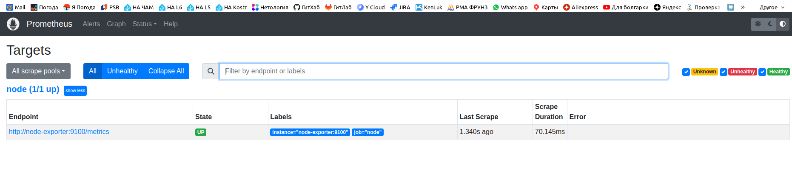
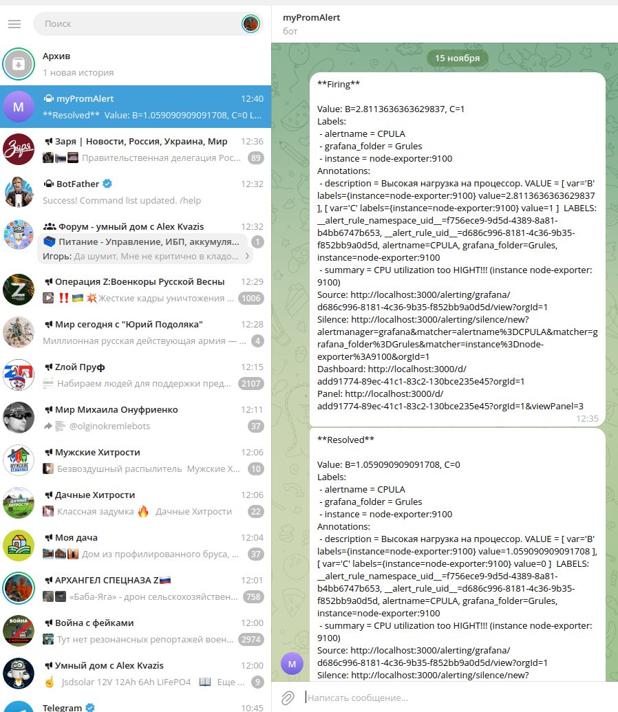

---


### Учебная группа DevOps-32

---

## Решение по домашнему заданию 10-monitoring-03-grafana к занятию 14 «Средство визуализации Grafana»


- [Описание](#description)
- [Предварительные проверки](#precheck)
- [Работа с панелями Grafana](#grafana)
- [Настройка Alert-ов](#alerts)
- [Результат в Telegram](#telega)
- [Исполнитель](#student)

---

###### Description
### Описание

Домашнее задание выполнялось без использования материалов из директории `help`.

Для выполнения использовались:  

- манифест `docker-compose` [docker-compose.yml](./docker-compose.yml)
- файл конфигурации `Prometheus` [prometheus.yml](./prometheus/prometheus.yml)

Также был настроен [telegram-bot](https://t.me/BeatlPromBot) для отправки alert-ов из `Grafana`

Домашнее задание выполнялось в `docker` на локальной машине.

---

###### precheck
### Предварительные проверки

После успешного разворачивания контейнеров из манифеста проверяем, что компоненты работают по отдельности. 

<details>
    <summary> Cкриншот `node-exporter`...  </summary>


</details>

<details>
    <summary> Cкриншот вывода `node-exporter` metrics...  </summary>


</details>

<details>
    <summary> Cкриншот `Prometheus`...  </summary>



</details>

<details>
    <summary> Cкриншот вывода `Prometheus` metrics...  </summary>


</details>

<details>
    <summary> Cкриншот конфигурации `Prometheus`...  </summary>


</details>

---

###### grafana
### Работа с панелями Grafana

После авторизации в WEB UI `Grafana` настраиваем в качастве data-source `Prometheus`:

<details>
    <summary> Cкриншот настройки data-source`...  </summary>


</details>

Далее создаем и сохраняем панели для `dashboard`.

Панель `CPU utilzation`:

<details>
    <summary> promql-запрос для CPU utilzation...  </summary>

```
avg by (instance)(rate(node_cpu_seconds_total{instance="node-exporter:9100",job="node",mode="idle"}[1m])) * 100
```

</details>

<details>
    <summary> Cкриншот настройки панели CPU utilzation...  </summary>


</details>

Панель `CPULA`:

<details>
    <summary> promql-запрос для CPULA...  </summary>

```
100 - (avg by (instance)(rate(node_cpu_seconds_total{instance="node-exporter:9100",job="node",mode="idle"}[1m])) * 100)
100 - (avg by (instance)(rate(node_cpu_seconds_total{instance="node-exporter:9100",job="node",mode="idle"}[5m])) * 100)
100 - (avg by (instance)(rate(node_cpu_seconds_total{instance="node-exporter:9100",job="node",mode="idle"}[15m])) * 100)
```

</details>

<details>
    <summary> Cкриншот настройки панели CPULA...  </summary>


</details>

Для панелей `Количество свободной оперативной памяти` и `Количество места на файловой системе` promql-запросы не использовались, панели настраивались прямо из интерфейса `Grafana` посредством `Metrics browser`.

<details>
    <summary> Общий вид итоговой Dashboard...  </summary>


</details>

[JSON-файл конфигурации dashboard](./Netology Homework-1700042623780.json)


---

###### alerts
### Настройка Alert-ов

Настраиваем `Contact points` для `Telegram`

<details>
    <summary> Скриншот страницы настройки Contact points...  </summary>


</details>

далее настраиваем `Notification policy`

<details>
    <summary> Скриншот страницы настройки Notification policy...  </summary>


</details>

далее настраиваем `Alert rule`

<details>
    <summary> Скриншот страницы настройки Alert rule...  </summary>


</details>

<details>
    <summary> Итоговый вид `Alert rules`...  </summary>


</details>

Сохраняем и прменяем все изменения....

---

###### telega
### Результат в Telegram

Настройка Телеграм-бота подробно описана в Inet и не представляет сложности

<details>
    <summary> Скриншот telegram-bot...  </summary>



</details>

---

###### Student
### Исполнитель

Сергей Жуков DevOps-32

---